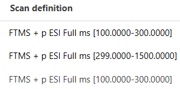

# Scan selection filters

Scan selection filters define which scans a module processes or displays. The same filter dialog is
reused by data import, processing, export, and visualization modules, although the parameter may be
named **Scans**, **Scan filters**, **Scan selection**, or something more specific such as **EIC
scans**.

!!! info

    Scan-selection defaults depend on the module. Some modules start with all scans, while others
    preselect MS1, MS2, or MSn scans. Always check the value shown in the module dialog.

The scan-filter group can be enabled or disabled. When it is disabled, all scans are selected and
the values inside the group are ignored. When enabled, all configured criteria are combined: a scan
must satisfy every active criterion to be selected. Leaving an individual field empty does not
restrict that property.

## Filters

#### Scan number

Includes scans whose scan numbers fall within the specified inclusive range. Either endpoint may be
left empty to create an open-ended selection.

#### Base Filtering Integer

Selects every _N_th scan, starting with the lower endpoint of **Scan number** when that range is
set,
or with the first scan number in the raw data file otherwise. For example, `N = 3` selects the
starting scan, skips two scans, and then repeats. Use a positive, non-zero integer.

#### Retention time

Includes scans in the specified inclusive retention-time range, in minutes. The lower endpoint must
be non-negative and smaller than the upper endpoint.

#### Mobility

Includes ion-mobility data in the specified inclusive mobility range. A mobility scan must have a
mobility value inside the range. A frame is selected when its mobility range overlaps the configured
range. This criterion does not exclude scans that have no mobility dimension.

The mobility unit depends on the acquisition technique and the imported data, for example inverse
reduced mobility (1/K~0~) or drift time in milliseconds.

#### MS level filter

Selects scans by MS level:

- **All MS levels** applies no MS-level restriction.
- **MS1, level = 1** selects MS1 scans.
- **MS2, level = 2** selects MS2 scans.
- **MSn, level ≥ 2** selects all fragmentation levels from MS2 upward.
- **Specific MS level** selects the entered level only.

#### Scan definition

Matches the scan-definition text stored in the raw data. Matching is case-sensitive and applies to
the complete text. Use `*` as a wildcard for any sequence of characters; for example, `*FTMS*`
selects definitions containing `FTMS`. Scans without a definition do not match a non-empty filter.

If your acquisition includes multiple, scan ranges (e.g., on an Orbitrap instrument), it is
necessary to process the scan ranges individually. To filter for a specific scan range, set up the
scan definition like this: <code>\*100\*-300\*</code> and <code>\*299\*-1500\*</code>.

#### Polarity

Selects **Any**, **Positive**, or **Negative** polarity. **Any** applies no polarity restriction.

#### Spectrum type

Selects **Any**, **Profile**, **Centroided**, or **Thresholded** spectra. **Any** applies no
spectrum-type restriction.

## Combining filters

Filters narrow the selection cumulatively. For example, selecting **MS1**, **Positive** polarity,
and the retention-time range `1.0–10.0 min` includes only positive-polarity MS1 scans inside that
time range. It does not include scans that match only one or two of those criteria.

!!! tip

    If no scans are processed or displayed, temporarily clear or disable the scan filters and then
    add the required criteria back one at a time. Also verify that scan definitions, polarity, and
    spectrum type were imported as expected.

---

{{ git_page_authors }}
