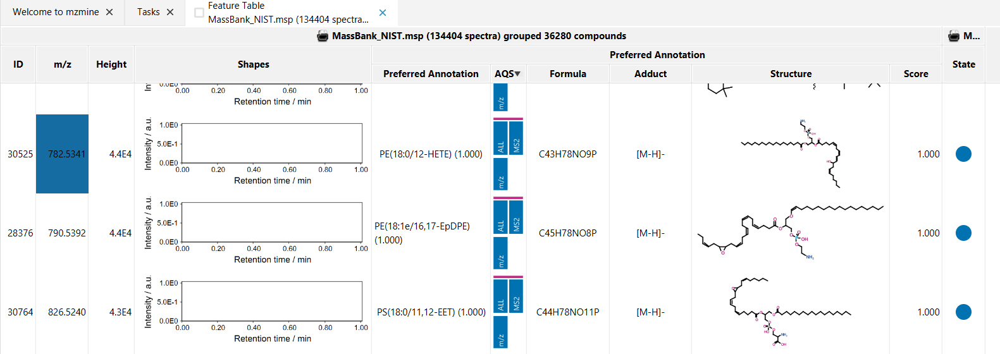

# Spectral library to feature list

## Description

:material-menu-open: **Feature list methods → Import spectral library as feature list**

This module converts one or more loaded spectral libraries into feature lists, making every library
entry browsable and processable inside the mzmine feature table UI.

### Use case: inspecting a spectral library

The primary use case is exploring the contents of a spectral library interactively. After
conversion, each library entry appears as a row in the feature table with its precursor m/z,
retention time (if available), and the annotated compound name. The MS2 spectrum of each entry is
directly accessible via the spectrum viewer, and all standard feature table functions apply:

- **Filter and sort** entries by m/z, compound name, adduct, collision energy, or any other metadata
  column.
- **View spectra** with mirror plots and annotated fragment ions.
- **Run annotation tools** such as spectral library search or formula prediction directly on the
  library entries to assess annotation quality or cross-match between libraries.
- **Export** the converted feature list for further processing or reporting.

## Parameters

#### Spectral libraries

The spectral library or libraries to convert. Select from the libraries currently loaded in the
project. Each selected library produces its own set of feature lists.

## Output

For each processed library, two feature lists are added to the project:

**`<library> single scans`** — one feature list row per library entry. The row's MS2 spectrum is the
library scan for that entry. Every row carries a spectral library match annotation with an identity
similarity score (100 %) pointing back to the same library entry.

**`<library> grouped <N> compounds`** — entries are grouped by compound identity (name, formula,
SMILES, InChI, InChIKey, and ion type must all match). One row is created per unique compound; all
library scans for that compound are attached as MS2 spectra and as separate spectral library match
annotations. This list is only created when the number of unique compounds is smaller than the total
number of library entries, i.e., when the library contains multiple spectra for the same compound (
e.g., different collision energies or adducts of the same structure).

---

{{ git_page_authors }}
