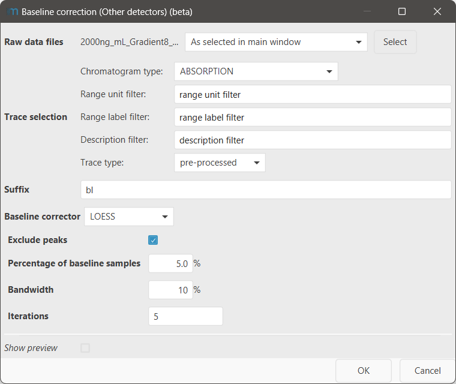

# Baseline correction (Other detectors)

!!! info
    To process data from other detectors, the Other detector service of mzmine is required. This feature
    is included in the mzmine PRO subscription. Academic program and other users can reach out to
    inquire [access options](https://mzio.io/#contact).

Baseline correction is a useful tool to correct for large drifts in baseline during chromatographic
separation. However, it can be tricky to optimize the baseline correction.

!!! Info
    While baseline correction can correct some drifts in the baseline, the better approach is usually to
    acquire a reference wavelength and reference the acquired data on that during the data acquisition.

## Parameters

#### Raw data files

Select the MS data files to baseline correct the selected traces of.

#### Trace selection

Select the specific traces you want to baseline correct. Typically, it is not necessary to baseline
correct all existing traces, but only the ones you want to correlate with the MS, e.g., the UV (
=Absorption) traces

For a detailed description of all sub-parameters
see [trace selection parameter](../otherdetector_glossary.md#trace-selection-parameter).

#### Suffix

A suffix that will be appended to the name of the individual trace.

#### Baseline correctors

##### Exclude peaks (all correctors)

If selected, two iterations per baseline correction will be performed internally. Initially the
baseline is corrected for the full chromatogram. Then, the baseline is subtracted and a peak
detection is performed to exclude peaks from the baseline calculation. In a second iteration, the
baseline correction is reapplied to the chromatogram, without including the peaks in the baseline
calculation.

###### Percentage of samples

Specify how many of the data points of the chromatogram shall be included in the baseline
calculation.
This values depends on the acquisition rate of the detector and if
previous [binning](../uv_shift_trim_bin_traces/uv_shift_trim_bin_traces.md#bin-width-manualauto) 
has been applied. The higher the acquisition rate, the lower the **percentage of samples**.

##### Loess

The LOESS (locally estimated scatterplot smoothing) baseline corrector fits the data using the LOESS
algorithm. It is the recommended baseline corrector in most scenarios, due to it's robustness. The
LOESS baseline corrector smoothes the baseline data.

###### Bandwidth

Specify how wide the window for the baseline calculation should be at any point of the chromatogram.
E.g., 10% means that 10% of the total data points are used at any specific retention time. For a
chromatographic run of 10 min, a total window of 1 min around each point will be taken into account.

###### Iterations

Specify how many iteratiosn the LOESS algorithm shall perform. This is independent of the iterations
specified in the [exclude peaks](#exclude-peaks-all-correctors) parameter. This parameter may
increase robustness against sudden changes in the baseline.

##### Polynomial

The polynomial baseline corrector fits the data using an nth degree polynomial.

###### Degree of Polynomial

Specify the degree of the polynomial. The higher the degree, the more the baseline will resemble the
original data (which may be a disadvantage).

##### Spline

The Spline baseline corrector uses a 3rd degree polynomial to fit 3 points of the raw
data. This means, that every input point will appear 1:1 in the corrected data, without any
smoothing or fitting (see [LOESS](#loess), [Polynomial](#polynomial)).

## Optimization

The **show preview** option is recommended to optimize the baseline correction.

#### Percentage of samples

The percentage of samples specifies how many data points of the baseline will be included in the
baseline correction. This parameter depends vastly on the acquisition rate. The influence of this
parameter is shown here:

#### Iterations (LOESS)

Increasing the number of iterations may reduce the occurrence of ghost peaks due to baseline
correction.
In case this does not help, [trimming traces](../uv_shift_trim_bin_traces/uv_shift_trim_bin_traces.md#trim-rt-range) may be the better
option.

