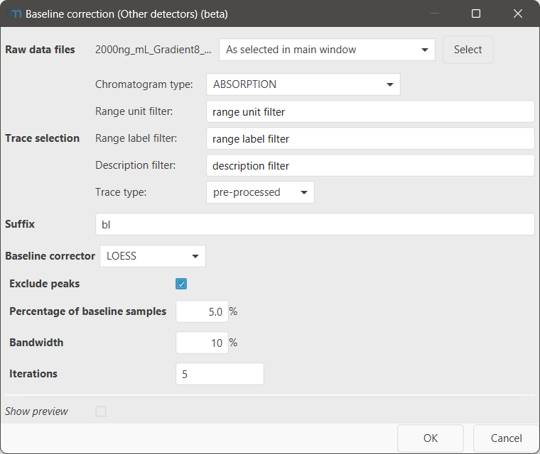
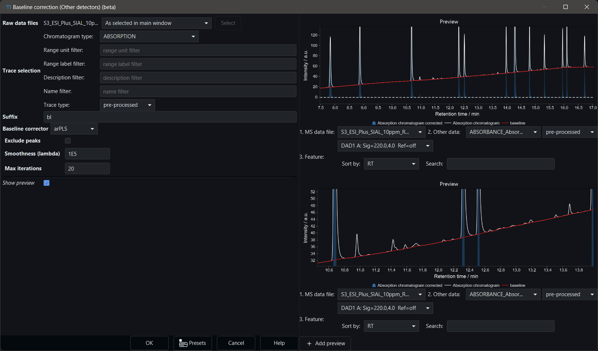

# Baseline correction

!!! info
    
    This documentation covers the MS and Other detector workflow. The difference is either selecting a
    feature lists or other raw files + traces.

!!! info

    To process data from other detectors, the Other detector service of mzmine is required. This feature
    is included in the mzmine PRO subscription. Academic program and other users can reach out to
    inquire [access options](https://mzio.io/#contact).

Baseline correction is a useful tool to correct for large drifts in baseline during chromatographic
separation. However, it can be tricky to optimize the baseline correction.

The module fits an estimated baseline to each selected trace and subtracts it. Corrected
intensities are clipped at zero, so the baseline itself may drop below zero (e.g. for detector
drifts) without producing negative signals. Four baseline correctors are available in the user
interface: [arPLS](#arpls) (default), [LOESS](#loess), [Polynomial](#polynomial) and
[Spline](#spline).

!!! Info

    While baseline correction can correct some drifts in the baseline, the better approach is usually to
    acquire a reference wavelength and reference the acquired data on that during the data acquisition.

## Recommended citations

!!! info

    When using the [arPLS](#arpls) baseline corrector, please also cite: 
    Baek, S.-J., Park, A., Ahn, Y.-J., Choo, J. Baseline correction using asymmetrically reweighted penalized least squares smoothing. Analyst 140, 250-257 (2015). https://doi.org/10.1039/c4an01061b

## Parameters

#### Raw data files

Select the MS data files to baseline correct the selected traces of.

#### Trace selection

Select the specific traces you want to baseline correct. Typically, it is not necessary to baseline
correct all existing traces, but only the ones you want to correlate with the MS, e.g., the UV (
=Absorption) traces

For a detailed description of all sub-parameters
see [trace selection parameter](../otherdetector_glossary.md#trace-selection-parameter).

#### Suffix

A suffix that will be appended to the name of the individual trace.

#### Baseline corrector

Select the baseline correction algorithm. The available options are [arPLS](#arpls) (default),
[LOESS](#loess), [Polynomial](#polynomial) and [Spline](#spline). Each corrector exposes its own
sub-parameters below the selection.

## Shared parameters

#### Exclude peaks

If selected, the baseline is estimated in two internal passes. First, the baseline is corrected for
the full chromatogram. Then that intermediate baseline is subtracted and a peak detection is run to
locate chromatographic peaks. In the second pass the baseline is fitted again, this time excluding
the detected peak regions so that peaks do not pull the baseline upwards.

This option is available for all four correctors. It is most useful for the interpolation-based
correctors ([LOESS](#loess), [Polynomial](#polynomial), [Spline](#spline)); [arPLS](#arpls) already
suppresses peaks on its own and usually works best with **Exclude peaks** disabled.

#### Percentage of baseline samples

Specify how many of the data points of the chromatogram are sampled to fit the baseline (default
5%). This value depends on the acquisition rate of the detector and whether
previous [binning](../uv_shift_trim_bin_traces/uv_shift_trim_bin_traces.md#bin-width-manualauto-_optional_)
has been applied. The higher the acquisition rate, the lower the **percentage of samples** can be.

!!! info

    This parameter is used by the [LOESS](#loess), [Polynomial](#polynomial) and [Spline](#spline)
    correctors. [arPLS](#arpls) fits the full trace and does not use it.

## Correctors

### arPLS

The arPLS (asymmetrically reweighted penalized least squares) baseline corrector is the default and
recommended corrector. It fits a smooth baseline to the whole trace and iteratively down-weights
data points that lie above the current baseline, so peaks are pushed out of the fit while the
baseline settles onto the lower envelope of the signal. It does not require an explicit peak
detection and therefore works well with **Exclude peaks** turned off.

#### Smoothness (lambda)

Controls how stiff the baseline is. Larger values yield a stiffer, smoother baseline that ignores
narrow signals; smaller values let the baseline follow the data more closely, but may start to
follow peaks. Typical range 1e3 - 1e7, default 1e5.

#### Max iterations

The maximum number of reweighting iterations (default 50). The fit usually converges well before
this limit, so this value rarely needs to be changed.

### LOESS

The LOESS (locally estimated scatterplot smoothing) baseline corrector fits the sampled baseline
points using the LOESS algorithm, which smooths the baseline locally. It is a robust choice when
arPLS is not suitable.

#### Bandwidth

Specify how wide the smoothing window is at any point of the chromatogram. E.g., 10% means that 10%
of the sampled data points are used at any specific retention time. For a chromatographic run of
10 min, a window of about 1 min around each point is taken into account. Larger values create a
smoother baseline but react more slowly to sharp shifts.

#### Iterations

Specify how many robustness iterations the LOESS algorithm performs (default 2). This is independent
of the iterations performed by the [Exclude peaks](#exclude-peaks) option and can increase
robustness against sudden changes in the baseline.

### Polynomial

The polynomial baseline corrector fits the sampled baseline points with an nth degree
polynomial.

#### Degree of polynomial

Specify the degree of the polynomial (default 4). The higher the degree, the more the baseline will
resemble the original data, which may be a disadvantage.

### Spline

The Spline baseline corrector fits a cubic (3rd degree) spline through the sampled
baseline points. The spline passes exactly through the sampled points and interpolates between them,
so — unlike [LOESS](#loess) — the sampled points are not additionally smoothed.

## Optimization

The **show preview** option is recommended to optimize the baseline correction.

#### Percentage of samples

The percentage of samples specifies how many data points of the baseline are included in the
baseline correction. This parameter depends vastly on the acquisition rate. The influence of this
parameter is shown here:

#### Smoothness (arPLS)

If the arPLS baseline follows the peaks too closely, increase **Smoothness (lambda)**; if it is too
stiff and floats above a curved baseline, decrease it.

### FAQ

Q: Ghost peaks appear at the start/end of my chromatogram when I apply baseline correction.

A: The ghost peaks are most often triggered by rapid shifts in the baseline, e.g. at the start of a
chromatogram during the dead volume or at the end when the column is reequilibrated. The best
solution is to restrict the retention time range to the relevant parts of the chromatogram
by trimming.

In
UV: [trimming traces](../uv_shift_trim_bin_traces/uv_shift_trim_bin_traces.md#trim-rt-range-_optional_)

In
MS: [Chromatogram builder](../../lc-ms_featdet/featdet_adap_chromatogram_builder/adap-chromatogram-builder.md#scan-filters)

Both options are controlled by
the [Wizard Crop retention time](../../../wizard.md#2-sample-introduction-system)

{{ git_page_authors }}
