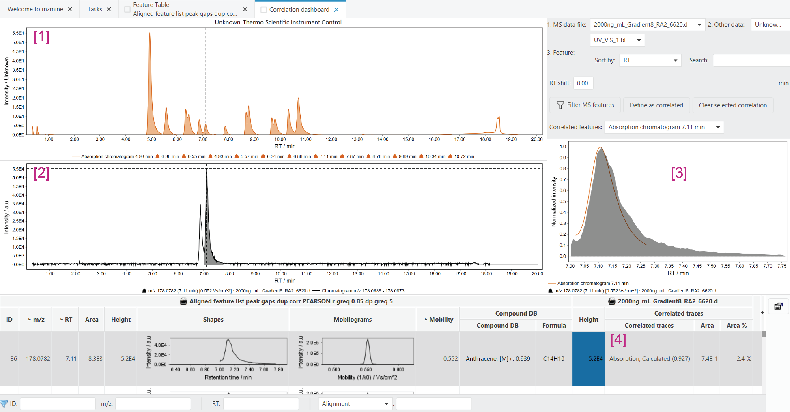
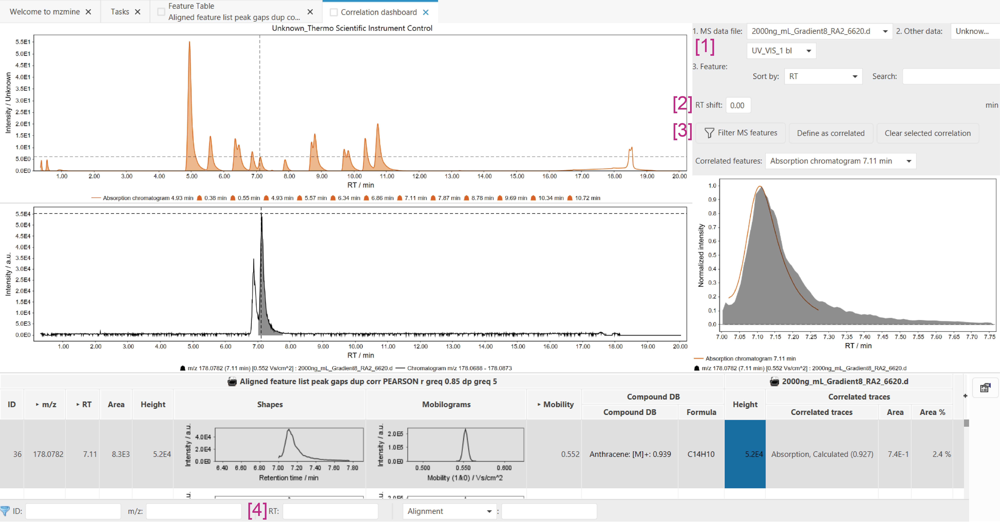

# Correlation dashboard

!!! info
   To process data from other detectors, the Other detector service of mzmine is required. This feature
   is included in the mzmine PRO subscription. Academic program and other users can reach out to
   inquire [access options](https://mzio.io/#contact).

The Correlation dashboard allows investigation of the results created by
the [Correlate Ms features with other detectors](../uv_ms_other_aligner/uv_ms_other_aligner.md).

## Interface

The interface is shown below:

1. Shows the full [preprocessed trace](../otherdetector_glossary.md#preprocessed-trace) (line) and
   detected [features](../otherdetector_glossary.md) (filled area) of the other detector trace. If
   an MS feature with an associated correlated trace is selected in the feature table, this plot
   updates automatically and re-positions the crosshair to the correlated feature. Selecting a
   different feature in this plot, will update the other detector feature in plot **3**.
2. Shows the full chromatogram (re-extracted from the raw data, line) and the selected feature from
   the feature table (area). Selecting a new feature in the feature table will update this plot. The
   RT axis is synchronized to plot **1**.
3. Shows an overlay of the selected MS feature (from the feature table) and the selected other
   detector feature.
   By default, if a new MS feature is selected, this plot automatically shows the correlated
   feature. If there is no correlated feature or the selection in plot **1** is updated manually,
   this plot shows the selected other detector feature from plot **1**.
4. Shows a feature table with the correlated other detector traces.

### Control panel

The additional controls are described below:

5. The trace selection allows selecting a specific other detector trace in case no correlation was
   found or the correlation was not executed yet.
6. Set an additional RT shift to the other detector trace. This is useful during method optimisation
   to determine the shift between the other detector and the MS. This shift can then be set in the
   wizard or the [Shift traces](../uv_shift_traces/uv_shift_traces.md) module.
7. **Filter MS features** sets the RT filter (**8**) of the feature table to the RT range of the
   currently selected other detector feature. This allows you to investigate all MS features that
   have their peak maximum in the RT range of the other detector feature.

   **Define as correlated** allows you to manually specify which feature should be marked as
   correlated.

   **Clear selected correlation** removes the currently selected correlated feature from the
   selected MS feature. Note that there may be more than one correlated feature. This button only
   removes a single one.
