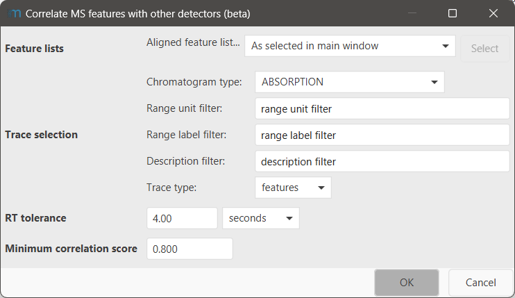
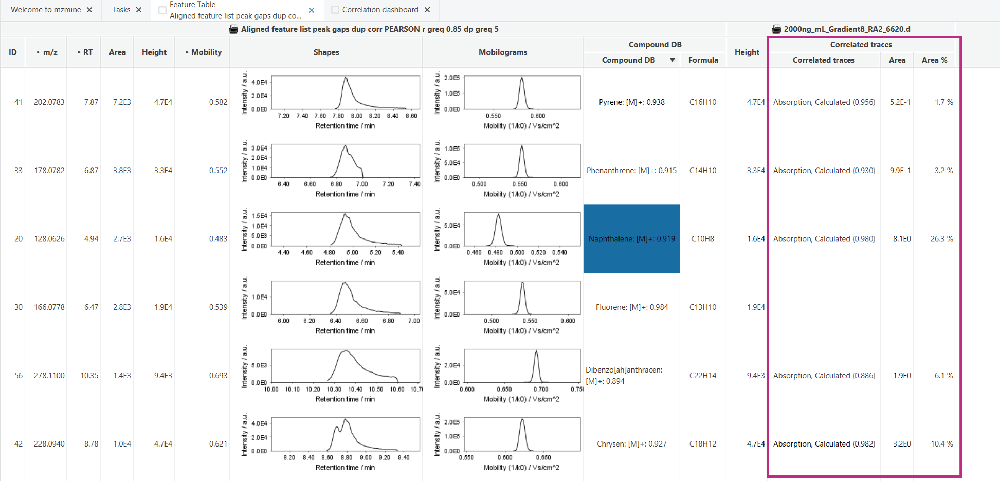

# Correlate MS features with other detectors

!!! info
    To process data from other detectors, the Other detector service of mzmine is required. This feature
    is included in the mzmine PRO subscription. Academic program and other users can reach out to
    inquire [access options](https://mzio.io/#contact).

This module correlates features of an MS workflow,
e.g., [LC-MS](../../../workflows/lcmsworkflow/lcms-workflow.md), to features from other detector
traces, allowing you to find which MS features are behind a certain peak in the UV, CAD, or
radioactivity chromatograms.

## Parameters

#### Feature lists

Select the feature list you want to correlate the other traces for. Each MS data file in the
selected feature list(s) will only be correlated to other detector features of it's own file. The
selected feature list may be an aligned feature list.

#### Trace selection

Select the specific traces you want to correlate to the MS features. Typically, it is not necessary
to correlate all existing traces.

For a detailed description of all sub-parameters
see [trace selection parameter](../otherdetector_glossary.md#trace-selection-parameter).

#### RT tolerance

Allowed RT difference of the peak maxima in the MS and other detector features.

!!! warning
    This allowed RT tolerance does not cause an alignment of the other detector feature and the MS
    feature. If the traces are affected by an retention time shift, use
    the [Shift traces](../uv_shift_trim_bin_traces/uv_shift_trim_bin_traces.md) module to correct for that shift. Not
    correcting an existing retention time shift will cause poor correlation between the two detectors.

#### Minimum correlation score

Set a minimum (Pearson) correlation factor between the chromatographic shape of the two features.

## Results

If correlated traces are found, the "Correlated traces" column will be added to the feature table. (
Not visible by default) You can enable it by clicking the "+" in the upper right corner of the
feature table and selecting the "Features:Correlated traces" type and the sub columns you want to
see.

Additionally, the [Correlation dashboard](../uv_correlation_dashboard/uv_correlation_dashboard.md)
allows a deeper investigation and also manually assigning or removing the correlated traces.

## Clear correlated traces

This module removes all correlated other detector traces from the selected MS feature list.

### Parameters 
#### Feature lists
The feature list to remove the correlated traces from.
