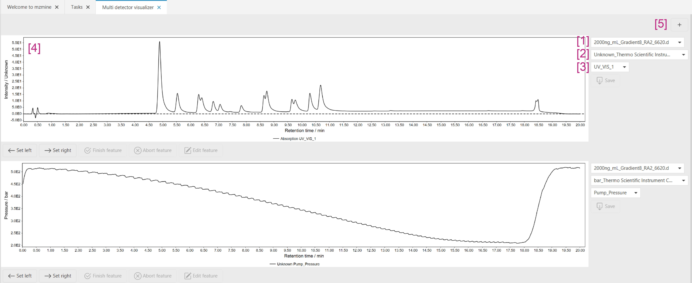
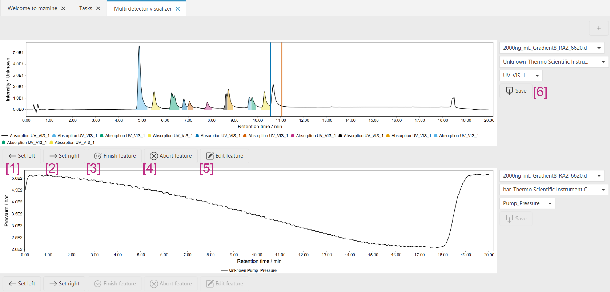

# Multi detector visualizer

The multi detector visualizer allows visualization and manual integration of **traces** from other
detectors.

To open the **Multi detector visualizer**, at least one data file in the project must contain data
from other detectors. Only files with such traces will be eligible for the visualizer.

## Visualizer layout

The visualizer is shown below:

1. Select the data file you want to visualize. After importing a new data file, the visualizer must
   be reopened.
2. This box lists the available detector traces for the selected files. The traces imported from the
   raw data will be named as such: `<unit>_<detector name>` and grouped by the unit of the detector.
   If they are created from other spectral data by
   the [Chromatogram builder (Other spectral data)](../uv_spectra_chromatogram_builder/spectrachrombuilder.md),
   the [Name parameter](../uv_spectra_chromatogram_builder/spectrachrombuilder.md#name) will be
   used.
3. Select the specific trace you want to visualize. In case there
   are [preprocessed traces](../otherdetector_glossary.md#preprocessed-trace), these will be used
   for visualization and [manual integration](#manual-integration).
4. The chromatogram chart shows the selected trace.
5. In case you want to visualize multiple files/traces, you can add another chart by the **+**
   button.

## Manual integration

Manual integration is performed by first selecting the trace you want to integrate (see above).

1. The left boundary of a peak is set by first clicking the "Set left" button and then clicking
   **on** the chromatogram in the chart or by holding <kbd>CTRL/⌘↓</kbd>+<kbd>CLICK</kbd>
2. The right boundary of a peak is set by first clicking the "Set right" button and then clicking
   **on** the chromatogram in the chart or by holding <kbd>CTRL/⌘↓</kbd>+<kbd>SHIFT↓</kbd>+<kbd>
   CLICK</kbd>
3. After setting the left and right boundary, the integration is accepted by clicking "Finish
   feature" or by <kbd>ALT↓</kbd>+<kbd>CLICK</kbd> in the chart.
4. In case a feature shall not be accepted and the boundaries shall be removed, you can use the "
   Abort feature" button.
5. After a feature has been accepted, you can re-edit it, by clicking the "Edit feature" button. If
   you want to delete a feature from a trace, start the editing mode and then press "Abort feature".
6. To save the manual edits, press the "Save" button. Unless "Save" is pressed, the edits will not
   be saved.
