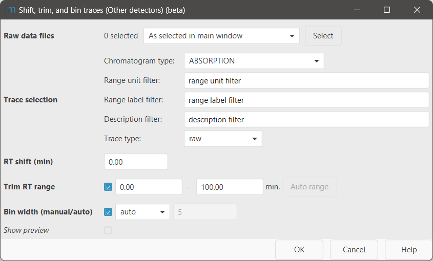

# Shift, trim, and bin traces (Other detectors)

!!! info
    To process data from other detectors, the Other detector service of mzmine is required. This feature
    is included in the mzmine PRO subscription. Academic program and other users can reach out to
    inquire [access options](https://mzio.io/#contact).

Commonly, a shift in the observed retention time is observed between the MS detector and other
detectors due to different lengths in flow path.

Sudden changes in background intensity, e.g., by changes in solvent composition, may lead to subpar
performance of the baseline correction. In such cases, it may be useful to trim the traces of other
detectors.

As other detectors typically have a higher acquisition rate than mass spectrometers, it may be
useful to bin the detected intensities/absorptions together to achieve a similar acquisition rate
for better [cross-correlation](../uv_ms_other_aligner/uv_ms_other_aligner.md) and processing
performance.

## Parameters

#### Raw data files

Select the MS data files to shift the selected traces of.

#### Trace selection

Select the specific traces you want to shift. Typically, it is not necessary to shift all existing
traces, but only the ones you want to correlate with the MS, e.g., the UV (=Absorption) traces

For a detailed description of all sub-parameters
see [trace selection parameter](../otherdetector_glossary.md#trace-selection-parameter).

#### RT shift

Specify the RT shift that shall be applied to the other detector. The numeric value will be added to
the retention time (minutes) of the other detector trace. Positive values will shift the trace
further back, negative values will shift the trace to the front.

#### Trim RT range

Specify the RT range you want to keep. Trimming will be applied **after** shifting.

#### Bin width (manual/auto)

Set how many points shall be binned.
"Auto" will adjust the acquisition rate of the other detector to **four** times the MS acquisition
rate.
"Manual" will bin the given number of points manually.

Binning will be applied **after** shifting and trimming.
