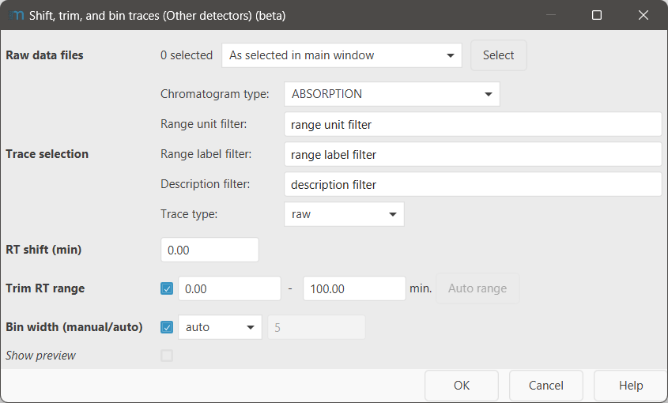
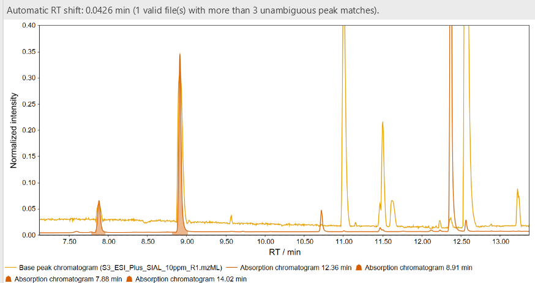

# Shift, trim, and bin traces (Other detectors)

!!! info
    To process data from other detectors, the Other detector service of mzmine is required. This feature
    is included in the mzmine PRO subscription. Academic program and other users can reach out to
    inquire [access options](https://mzio.io/#contact).

Commonly, a shift in the observed retention time is observed between the MS detector and other
detectors due to different lengths in flow path.

Sudden changes in background intensity, e.g., by changes in solvent composition, may lead to subpar
performance of the baseline correction. In such cases, it may be useful to trim the traces of other
detectors.

As other detectors typically have a higher acquisition rate than mass spectrometers, it may be
useful to bin the detected intensities/absorptions together to achieve a similar acquisition rate
for better [cross-correlation](../uv_ms_other_aligner/uv_ms_other_aligner.md) and processing
performance.

## Parameters

#### Raw data files

Select the MS data files to shift the selected traces of.

#### Trace selection

Select the specific traces you want to shift. Typically, it is not necessary to shift all existing
traces, but only the ones you want to correlate with the MS, e.g., the UV (=Absorption) traces.

For a detailed description of all sub-parameters
see [trace selection parameter](../otherdetector_glossary.md#trace-selection-parameter).

#### RT shift (manual/auto)

Sets the retention time offset that is added to each selected other detector trace. Positive values
shift the trace to later retention times, negative values to earlier retention times.

- **Manual** applies the entered offset (in minutes) directly. Default: `0`.
- **Auto** determines one global offset automatically from the selected raw data files by matching
  peaks of the binned other detector trace against peaks of the MS base peak chromatogram. See
  [Algorithm](#algorithm) for details.

!!! tip
    Use **Auto** when the same instrument/method is reused across files, so a single shared offset
    is appropriate. For files with diverging chromatography, run the module per file or fall back
    to **Manual**.

#### Trim RT range _(Optional)_

Retention time range to keep. Trimming is applied **after** shifting.

#### Bin width (manual/auto) _(Optional)_

Number of consecutive data points to bin together.

- **Manual** uses the entered bin width.
- **Auto** sets the bin width so that the resulting other detector acquisition rate is roughly four
  times the MS acquisition rate (computed per file as `floor(other_rate / ms_rate) / 4`, with a
  minimum of `1`).

Binning is applied **after** shifting and trimming.

---

## Algorithm {#algorithm}

### Automatic RT shift

When **Auto** is selected for the RT shift, one global offset is calculated across all selected
files using the already binned other detector traces:

1. **Per-file peak detection.** The binned other detector trace and the MS base peak chromatogram
   are independently resolved into peaks using a wavelet-based peak picker.
2. **Unambiguous peaks only.** Peaks that have a direct neighbouring peak are discarded, since
   their apex matching would be ambiguous.
3. **Apex-based candidate shifts.** Each remaining other detector peak is paired with MS peaks
   within an apex tolerance window to generate candidate shifts.
4. **Shape correlation validation.** Each candidate shift is validated by Pearson correlation of
   the chromatographic shapes of the matched peaks. Matches require at least 5 correlated data
   points and a Pearson `r ≥ 0.8`.
5. **Per-file shift.** Validated matches are clustered and the dominant shift for the file is
   selected. Files with fewer than 3 validated matches are skipped.
6. **Global shift.** Per-file shifts from all valid files are combined into a single global
   offset that is applied to every selected file.

If no file yields a valid shift, the module fails with an error. Otherwise, the preview reports
the determined shift together with the number of contributing files and highlights the validated
peak matches as filled regions on the shifted trace:

!!! warning
    The automatic shift requires real LC-style peaks in both the MS BPC and the other detector
    trace. Traces dominated by baseline drift, single broad humps, or detector saturation will
    typically be skipped because they yield too few unambiguous, shape-correlated matches.
