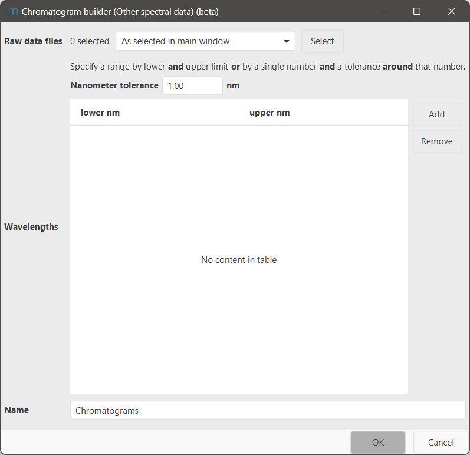

# Chromatogram builder (Other spectral data)

!!! info
    To process data from other detectors, the Other detector service of mzmine is required. This feature
    is included in the mzmine PRO subscription. Academic program and other users can reach out to
    inquire [access options](https://mzio.io/#contact).

The **Chromatogram builder (Other spectral data)** constructs chromatograms for data of other
detectors that were acquired alongside an MS detector. Spectral raw data without MS data cannot be
analysed by mzmine.  

## Parameters

#### Raw data files
Select the MS raw data files with spectra from other detectors to build chromatograms from.

#### Wavelengths 

Specify the wavelengths in **nm** that the chromatograms shall be built for.

You can specify either a range by giving a **lower and upper** limit, or by specifying only a single 
wavelength (in the lower **or** upper cell) and a **Nanometer tolerance** around the given single 
value. The tolerance is **not** applied to ranges, only single wavelengths.

The intensity inside a wavelength range is averaged when building the chromatograms.

#### Name

A name for the chromatograms. If that name is already in use, the existing chromatograms will be replaced.
