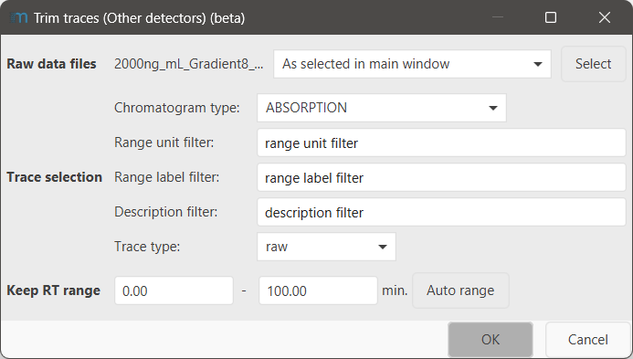

# Trim traces (Other detectors)

Sudden changes in background intensity, e.g., by changes in solvent composition, may lead to subpar
performance of the baseline correction. In such cases, it may be useful to trim the traces of other
detectors.

In case traces shall be trimmed, this module is recommended to be the first step in the processing
and typically uses the [raw trace](../otherdetector_glossary.md#raw-trace) as input.

## Parameters

#### Raw data files

Select the MS data files to trim the selected traces of.

#### Trace selection

Select the specific traces you want to trim. Typically, it is not necessary to trim all existing
traces, but only the ones you want to correlate with the MS, e.g., the UV (=Absorption) traces

**Chromatogram type** Specify the type of chromatogram you want to process. Usually, specifying this
is enough.

**Range unit filter** (Uncommon) filter the traces of the selected chromatogram type to only have a
specific unit on the range axis to be affected by this filter. Use `*` as a wildcard (match any
character)

**Range label filter** (Uncommon) filter the traces of the selected chromatogram type to only have a
specific label on the range axis to be affected by this filter. Use `*` as a wildcard (match any
character)

**Description filter** (Uncommon) filter the traces of the selected chromatogram type to only have a
specific description (=name) to be affected by this filter. Use `*` as a wildcard (match any
character)

**Trace type** Specify the [trace type](../otherdetector_glossary.md#trace-type) to be used as input
for this module.

#### Keep RT range

Specify the RT range you want to keep.
