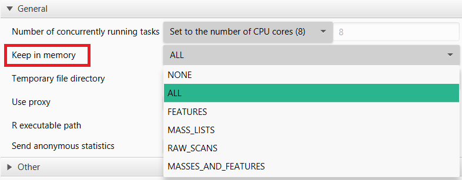

This section contains information on how to tune MZmine 3 for different systems.

## Preferences
The preferences can be changed in MZmine's graphical user interface by accessing _File/Set preferences_ from the menu. The choices will be stored in a (hidden) _.mzmine3.conf_ file in the user's home directory (Windows: _C:\Users\USERNAME_) once MZmine is closed.


{: style="width:200px"}  {: style="width:500px"}  {: style="width:500px"}

## Logs
Currently, the logs are written to an _mzmine_0_0.log_ file in the user's home directory. Please submit your log files together with any issues on **[GitHub](https://github.com/mzmine/mzmine3/issues)**.


## Command-line arguments
Command-line arguments offer a variety of options that generally override the corresponding parameters in the preferences.


**Windows**

An easy way to start MZMine with arguments is to create a shortcut to the MZmine.exe, right-click, and define the target with additional arguments. This example runs MZMine in batch mode (headless), imports the specified batch file, overrides the memory management to **none** (which is the default), effectively using memory mapping to store and access spectral, centroid, and feature data from temporary files stored in the defined temp directory. By leaving out the _memory_ or _temp_ arguments, the values stored in the current _preferences_ file will be used, or the default values if no _preferences_ file was found.  

**Start MZmine batch with memory mapping (**DEFAULT**)**
```
"C:\Program Files\MZmine\MZmine.exe" -batch "D:\batch\my_batch_file.xml" -memory none -temp "D:\tmpmzmine"
```


**Start MZmine batch on machines with enough memory (RAM) with -memory all**
```
"C:\Program Files\MZmine\MZmine.exe" -batch "D:\batch\my_batch_file.xml" -memory all -temp "D:\tmpmzmine"
```

### Argument table

| Argument | Options (**default**) | Description |
| --- | --- | --- |
| -batch | a path, e.g. "D:\batch.xml" | Path to batch file |
| -memory | **none**, all, features, centroids, raw, masses_features | Defines what data is kept in memory (RAM) or otherwise memory mapped to the temp directory. Generally this setting should be _none_. If memory is no issue this option might be set to _all_ process all spectral and feature data in memory. The option _masses_features_ keeps centroid mass lists and features in memory while memory mapping raw spectral data. |
| -temp | a path, e.g., "-temp "D:\tmpmzmine\" | The defined directory should be on a fast drive (usually SSD > HDD > network drive) with enough free space. Local drives are usually preferred. MZmine uses memory mapping to efficiently store and access spectral and feature data. This can lead to a considerable temporary consumption of disk space. Make sure that the selected drive has enough space (maybe 20 GB + 1 GB/10 files; generously over estimated). |
