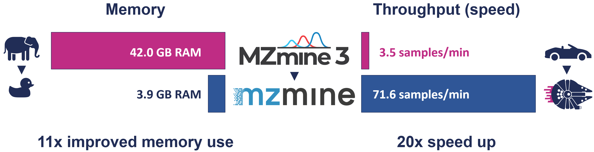

# Benchmarking

mzmine simplifies benchmarking through its batch mode. Any batch workflow running in mzmine will
measure the run time and output the results in the log file as tab-separated tabular data.

!!! info

    Open the log file through **Help/Show log file** and scroll to the bottom after running a batch 
    workflow to find the tabular benchmarking results. 

[](../additional_resources.md#performance)

## General considerations

### mzmine performance tuning

mzmine is tuned for higher processing speeds. This means that if more RAM is available, mzmine may
use additional RAM for faster processing. The [**performance options**](../performance.md) allow
constraining the memory available to mzmine, which is a good option on larger servers with much
installed RAM. The defaults should work great on most hardware by auto-scaling the used RAM.

### The challenge to measure used random access memory (RAM)

Monitoring RAM usage of modern applications running on modern operating systems is challenging.
mzmine brings its own **Java Virtual Machine** (JVM) that runs mzmine and continuously optimizes the
performance during its runtime. Memory is dynamically managed by the JVM. mzmine will allocate more
memory if available and not contested by other processes.

!!! warning

    **Windows Task Manager** **lacks** the tools to measure the used RAM and will always show the memory managed
    by the JVM instead. This value mostly reflects how much memory is available to mzmine but has no 
    real value in measuring its performance.

**Garbage collection** (GC) is a JVM process to reclaim memory from unused objects like intermediate
processing results. By default, mzmine only runs GC when there are memory constraints. An option in
the preferences enables GC after each batch processing step. This is usually only needed for more
accurate measurements during benchmarking.

### Manual garbage collection {#manual-gc}

The user may run **manual garbage collection** by clicking the **RAM usage bar** in the
bottom right corner of the graphical user interface (GUI). After running manual GC, the memory bar
will show the used memory and the logs will print a message like below:

```
Freeing unused memory
Used heap memory after manual GC: 0.26 GB
```

## Example benchmark output

### Processing time

The processing time is measured as elapsed seconds between starting and finishing each step in a
batch workflow. The total time is reported as the last line in the output table.

### Memory (RAM)

The **usedHeapGB** in the table below provides a readout of how much RAM was used by mzmine after
finishing a batch processing step. It is only available after activating it in the preferences. See
below. After running a memory benchmark batch from the GUI, it is still advised to run a manual
garbage collection step to get the final used memory. This value is usually very close to the last
print-out in the table, but sometimes a bit lower still. In headless command line mode the only
readout is the table and there is no manual GC option.

!!! info

    Activate the RAM measurements in the preferences by selecting the **Free memory in batch** option.
    This option will run the internal memory cleanup, i.e. the JVM garbage collection (GC), after every step.
    This will have a small impact on the processing speed, so for benchmarking processing throughput this option is best disabled.

### Table output in the log file

| step | secondsToFinish | name                           | usedHeapGB |
|------|-----------------|--------------------------------|------------|
| 1    | 1.567           | Import MS data                 | 0.21       |
| 2    | 0.357           | Mass detection                 | 0.23       |
| 3    | 3.502           | Chromatogram builder           | 0.32       |
| 4    | 0.409           | Local minimum feature resolver | 0.28       |
| 5    | 0.846           | Join aligner                   | 0.29       |
| 0    | 7.064           | WHOLE BATCH                    | 0.29       |
