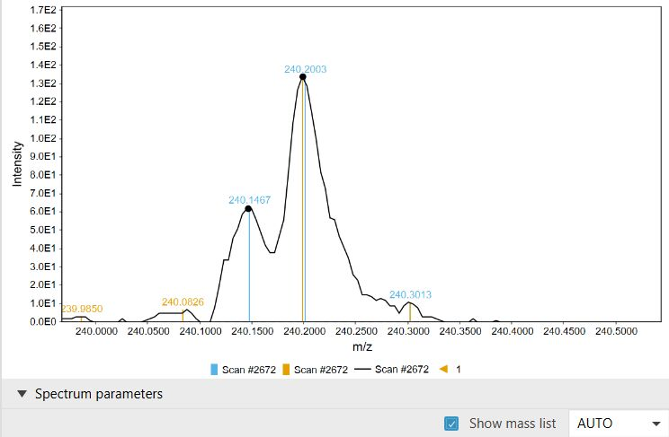

# mzmine preferences

:material-menu-open: **Project -> Set preferences**

The mzmine preferences control global behavior such as memory handling, number formats, chart
appearance, and vendor data import defaults. They apply to newly opened dialogs, newly imported raw
data files, and newly created plots or feature lists, depending on the setting.

Preferences are saved in the user configuration file (`.mzmine/.mzconfig` in the user's home
directory). You can also save or load a configuration file from **Project -> Save configuration** or
**Project -> Load configuration**. For command-line and batch processing, a specific `.mzconfig`
file can be loaded with the `-p` / `-pref` option, while command-line options such as `--temp`,
`--memory`, and thread settings can override the loaded preferences for that run.

!!! tip "First settings to check"

    For most installations, first set the **Temporary file directory** to a fast local SSD and keep
    **Keep in memory** at **NONE** unless your system has enough RAM for the complete workflow.

## Preference groups

The dialog is organized into four groups:

| Group          | What it controls                                                                                                     |
|----------------|----------------------------------------------------------------------------------------------------------------------|
| General        | Parallel tasks, memory mapping, temporary files, IMS storage strategy, and proxy settings                            |
| Formats        | Display formats for m/z, retention time, mobility, CCS, intensity, scores, ppm, percent values, and unit labels      |
| Visuals        | Tab labels, chart colors, paint scales, chart theme defaults, application theme, image display, and precursor labels |
| MS data import | Default vendor import and centroiding behavior for drag-and-drop import, the mzwizard, and raw data import dialogs   |

## General

### Number of concurrently running tasks

Controls how many mzmine tasks may run in parallel. The default is automatic and uses the available
processor count. Lower this value when you want to leave CPU resources for other applications or for
other jobs on a shared workstation.

### Keep in memory

Controls which data objects stay in RAM instead of being memory mapped to temporary files. The
default is **NONE**, which memory maps spectral data and feature data to the temporary directory.
This is usually the best setting for large projects because it keeps RAM usage predictable.

Available options are:

| Option              | Effect                                                                                          |
|---------------------|-------------------------------------------------------------------------------------------------|
| NONE                | Memory map spectral data, mass lists, and feature data to temporary files. This is the default. |
| ALL                 | Keep all supported data in RAM. Use only when memory is not a constraint.                       |
| FEATURES            | Keep feature data in RAM.                                                                       |
| MASS_LISTS          | Keep centroid mass lists in RAM.                                                                |
| RAW_SCANS           | Keep raw spectral data in RAM.                                                                  |
| MASSES_AND_FEATURES | Keep centroid mass lists and feature data in RAM while memory mapping raw scans.                |

The command-line `--memory` option overrides this preference for a command-line run.

### Optimize IMS processing

Controls how ion mobility feature data is stored. **Memory efficiency** is the default and stores
references to individual mobilograms in temporary files. **Speed** keeps those references in RAM.
Changes affect feature lists created after the preference is changed.

### Temporary file directory

mzmine uses temporary files for memory-mapped spectra, mass lists, and feature data. Choose a fast
local SSD with enough free space. Avoid slow network drives and removable drives when possible.

Restart mzmine after changing this directory so all new project data uses the intended location. The
command-line `--temp` option overrides this preference for a command-line run.

### Free memory in batch (experimental)

Runs garbage collection after each batch step. This can reclaim memory sooner, but may slightly
reduce throughput. Keep it disabled unless a specific batch workflow benefits from it.

### Fast temp files cleanup

Deletes temporary files as soon as mzmine no longer needs them. This is enabled by default.

### Proxy

Configures proxy settings for internet access, including downloads, online services, and other
network calls from mzmine.

## Formats

The format preferences control how values are displayed in the graphical interface. They do not
change raw data, feature detection, or calculations.

| Preference                  | Default display pattern | Used for                                           |
|-----------------------------|------------------------:|----------------------------------------------------|
| m/z value format            |                `0.0000` | m/z values                                         |
| Retention time value format |                  `0.00` | Retention times                                    |
| Mobility value format       |                 `0.000` | Ion mobility values                                |
| CCS value format            |                   `0.0` | Collision cross section values                     |
| Intensity format            |                 `0.0E0` | Intensities                                        |
| PPM format                  |                   `0.0` | ppm mass errors                                    |
| Score format                |                 `0.000` | Scores such as correlations or cosine similarities |
| Percent format              |                  `0.0%` | Percent values                                     |
| Unit format                 |                  DIVIDE | How units are written in labels                    |

## Visuals

### Show tab sub titles

Shows the related raw data file or feature list name in tab headers. This is enabled by default.

### Default color palette and default paint scale

Set the default colors used for charts and the default paint scale used for heat maps and image-like
views.

### Chart parameters

Defines chart-wide defaults such as fonts, background color, axis style, and item label styling.

### Theme style and theme colors

The application theme is assembled from a structural **Theme style** and a **Theme colors** palette.
The default style is **Classic (JabRef)** and the default colors are **Light**. Dark themes are
available, and mzmine can offer to adjust chart colors when switching between light and dark themes
if the existing chart colors would be hard to read.

### Presentation mode

Increases the main interface font size for presentations or high-DPI display situations. Chart fonts
are still controlled by **Chart parameters**.

### Show precursor windows

Shows precursor isolation windows instead of only the precursor m/z where mzmine has the isolation
window information.

### Image paint scale transformation and image normalization

Control newly generated MS imaging plots. Image normalization defaults to **No normalization**;
**Average TIC normalization** normalizes displayed image traces to the average total ion current.
The paint scale transformation defaults to a linear scale.

## MS data import

These preferences are copied into vendor import parameters used by drag-and-drop import, the
mzwizard, and import dialogs. Some dialogs expose the same options for a single import; changing a
single import dialog does not permanently change the global preferences.

### Apply vendor centroiding (recommended)

Enabled by default. When enabled, mzmine asks supported vendor readers or converters to centroid raw
data during import. Vendor-specific centroiding usually gives better results than applying a generic
centroiding method later. When disabled, supported vendor data is imported as profile data where the
reader can provide it.

### Waters MassLynx data import

Controls how Waters MassLynx files are imported. The default is **Native (mzmine as vendor
centroiding, recommended)**. **MSConvert** can convert to mzML first and allows converted files to
be
kept for faster re-import, but it does not centroid IMS data during conversion. **Native (Waters
vendor centroiding)** uses Waters centroiding, which can be slow for IMS data.

<!--
### Agilent .d data import

Controls whether Agilent `.d` data files are imported through the native AgilentReader or through
MSConvert. The default is **Native (AgilentReader, auto-centroid IMS)** with **Prefer stored
centroids** as the centroid source.

| Option                                    | Use when                                                                                                    |
|-------------------------------------------|-------------------------------------------------------------------------------------------------------------|
| Native (AgilentReader)                    | Native Agilent import on Windows, mobility scans are imported as profile.                                   |
| Native (AgilentReader, auto-centroid IMS) | Same as Native Agilent, but uses mzmine algorithms to automatically centroid mobility scans. (if requested) |
| MSConvert                                 | You want Agilent `.d` files converted to mzML first. This path is Windows-only.                             |

When [Apply vendor centroiding](#apply-vendor-centroiding-recommended) is enabled, the embedded
centroid source decides how the native
AgilentReader obtains centroid spectra:

| Centroid source         | Effect                                                                                                                       |
|-------------------------|------------------------------------------------------------------------------------------------------------------------------|
| Prefer stored centroids | Uses vendor-stored centroids when present; recentroids the profile only when stored centroids are unavailable.               |
| Prefer recentroided     | Reads the profile data and recomputes centroids; falls back to stored centroids when no profile representation is available. |

In the comparison above, black shows the profile spectrum with dots indicating the mzmine-computed
centroids. Yellow shows centroids recomputed from
the profile (**prefer recentroided**), and blue shows the **stored** vendor centroids. Stored
centroids and recentroided peaks can
differ in m/z position and intensity, so choose one strategy and keep it consistent across a study.

-->

### Apply lockmass on import (Waters)

Enabled by default for native Waters import. The default lock masses are 556.276575 for positive
mode and 554.262022 for negative mode.

### MSConvert path

Sets the MSConvert executable location used for automatic conversion of supported vendor formats to
mzML during import.

### Keep files converted by MSConvert

Stores mzML files generated by MSConvert. This can make repeated imports faster, but requires more
disk space.

### Thermo raw file parser location

Optionally overrides mzmine's internal Thermo raw file parser location. On macOS, an external parser
and Mono may be required.

### Remove calibrant signals (Thermo)

Enabled by default. Removes internal Thermo Orbitrap calibration signals from MS1 and MS2 spectra
during import. For MS3 and higher, use the **Scan signal removal** module.

{{ git_page_authors }}
