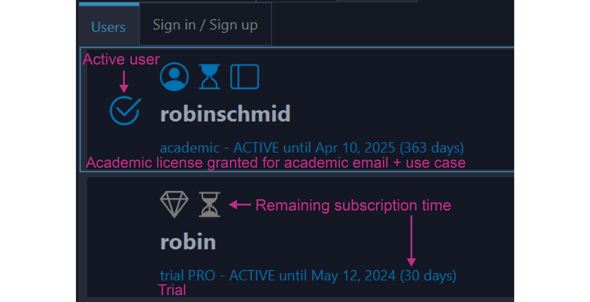
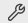

# Users management

## Sign up / Registration

Users can sign in into an existing account or sign up (register) a new free account within seconds.
The sign up is available
directly in the mzmine **Users** menu (Manage users). If you experience any issues with the built-in
webview, click the
external browser button and sign up online. Briefly, the user needs to provide few details
including:

- **Username**: Fixed identifier that cannot be changed
- **Define your use case**: The intended use of this user profile, either **commercial use** or *
  *non-profit academic use**
- **Email**: Either an academic, company, or personal email address. It is important to use an
  academic email address to gain a non-profit academic license
- **Read and accept the [Terms and Conditions](https://mzio.io/general-terms-and-conditions/)**

After clicking the register button, a verification email is sent to the provided address. This can
take
a few minutes.

1. Please open the email
2. Click the verification link that redirects to the user portal
3. Verify the email by **Click here to proceed** to verify your email
4. Return to mzmine and refresh the page (automatically done every 30 seconds)
5. Check your license status in mzmine. Every user will receive a 30-day trial license or a
   non-profit academic license. Please reach out if your academic institution still needs our
   automatic validation.

## Offline use

Sign in to your user in mzmine on a computer that is connected to the internet. Click on the menu
**User/Open users directory** to open the file explorer at your systems user/.mzmine/.users
directory.
Copy the corresponding users (.mzuser files) to the new system into the same directory.
Alternatively copy the files
to the other system and drag-and-drop them into mzmine. The users will be installed.
Finally, open the **Users/User management** and select the active user.

## User account console - changing user details

Open the [mzio user account console](https://auth.mzio.io/realms/mzio/account/) and sign in with
your user
credentials. Go to personal information to update any details. When changing the **email** the user
is automatically
logged out. On the next sign in, the user will receive another verification email to validate email
address ownership.
Revalidation of the email also triggers a revalidation of the **non-profit academic license**.

### Changing password & adding Two-factor authentication

Within the account console, navigate to **Account security/Signing in** and update your password.
Two-factor authentication can be activated on the same page. Start the setup and follow the
instructions.
This requires a mobile authenticator app that will generate a one-time-password for each sign in.

## Reset password

On the sign in page in mzmine or in
the [user account console](https://auth.mzio.io/realms/mzio/account/) click on **Forgot Password**,
enter your username or email.
An email for resetting the password will be sent to the users email within a few minutes. Follow the
instruction by
clicking on the link and entering a new password.

## Sign up / Registration details

Open mzmine and navigate to **Users/Manage users**, alternatively click on the user icon on the
mzmine landing page.
If you have a user account sign in. Otherwise, click on **register**.

Fill in the registration form and provide all details including:

- **Username**: Fixed identifier that cannot be changed
- **Define your use case**: The intended use of this user profile, either **commercial use** or *
  *non-profit academic use**
- **Email**: Either an academic, company, or personal email address. It is important to use an
  academic email address to gain a non-profit academic license
- **Read and accept the [Terms and Conditions](https://mzio.io/general-terms-and-conditions/)**

After clicking the register button, a verification email is sent to the provided address. This can
take
a few minutes.

1. Please open the email
2. Click the verification link that redirects to the user portal
3. Verify the email by **Click here to proceed** to verify your email
4. Return to mzmine and refresh the page (automatically done every 30 seconds)
5. Check your license status in mzmine. Every user will receive a 30-day trial license or a
   non-profit academic license. Please reach out if your academic institution still needs our
   automatic validation.

## Command-line interface (CLI)

Users can be logged in via command-line arguments to run mzmine in batch mode.
See [CLI tools](../commandline_tool.md) for more information.

## Alternative Sign in / Sign up

Alternatively users can register on the mzio.io
website [https://auth.mzio.io/realms/mzio/account](https://auth.mzio.io/realms/mzio/account/) by
clicking on the **Sign in** button in the top right corner.
Then follow the regular self-registration described above. Finally, users will need to sign in to
the mzmine software. If the sign in website does not load in mzmine, click
the . Set a proxy and retry with the login screen but if this fails
try the alternative sign in by username and password directly. The mzmine CLI also provides the *
*-login-console** argument for alternative sign in.

## Frequently asked questions (FAQ)

1. Why is the link to verify my email address missing?
    - Your email provider may remove links as a security measure. Please reach out to your
      postmaster or IT administrator with _info@mzio.io_ in Cc to resolve this issue. Please provide
      the information that links are missing and that the domain mzio.io can be trusted.

2. Why am I not receiving any verification email?
    - Your email provider may falsely block the mzio.io domain. Please reach out to your postmaster
      or IT administrator with _info@mzio.io_ in Cc to resolve this issue. Please provide the
      information that the domain mzio.io can be trusted.

3. The login page in mzmine is not loading, what can I do?
    - The poxy settings and alternative sign in page may open automatically or is available by
      clicking on the tool button  on the _Sign in/Sign up_ page.
    - Check your computers proxy settings and apply them on this page and press update proxy to
      retry.
    - Otherwise, try the alternative sign in by username and password. This requires an existing
      mzmine user that can also be registered on the website. 