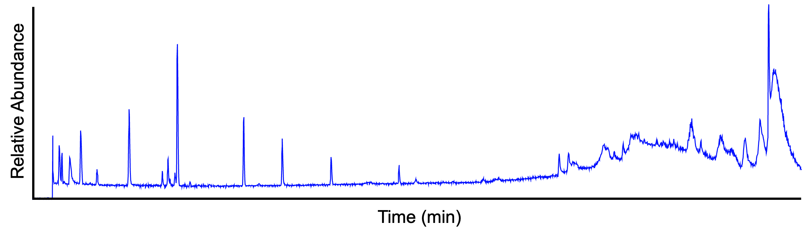
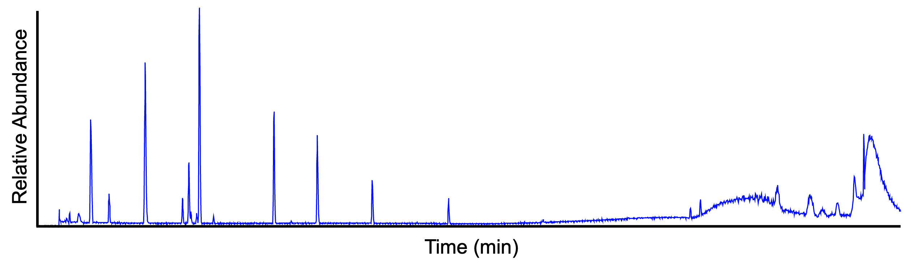

# General terminology

## MS
See https://onlinelibrary.wiley.com/doi/abs/10.1002/9781119377368.ch3

### Precursor and fragment ions
The precuror ion (a.k.a. "parent ion") is the ion that dissociates to a smaller fragment ions in a MS/MS experiment. A fragment ion (a.k.a. "daughter ion" or "product ion") is the charged product of an ion dissociation. A fragment ion may be stable itself or may dissociate further to form other charged fragment ions and neutral species of successively lower mass.

### Accurate mass, exact mass and mass accuracy 
The accurate mass is the experimentally-determined mass of an ion measured with an high-resolution mass spectormeter. The exact masss is the calculated mass of an ion based on its elemental formula, isotopic composition and charge state. While the accurate mass is an experimentally-measured quantity, the exact mass is a theretically-calculated quantity. The mass accuracy is defined as the difference between the measured value (accurate mass) and the true value (exact mass). It can be expressed either in absolute (mDa) or relative (ppm) terms.

### Monoisotopic mass
Exact mass of an ion calculated using the mass of the lightest isotope of each element.

### Mass resolution 
Todo. Often called/expressed as mass resolvin power

### Full scan acqusition mode
Todo

### Data-dependent acqusition mode
In data-dependent acquisition (DDA) schemes, the mass spectrometer detects 'suitable' precursor ions in each MS scan and selects them for fragmentation in consecutive MS2 scans. 
Todo:'Cycle time' and 'topN' acquisition schemes

### Data-independent acqusition mode
Todo

## LC-MS
### Total ion current chromatogram
The total ion current (TIC) chromatogram displays the summed signal intensity (y-axis) over the entire m/z range at any one retention time point (x-axis) in the LC-MS run. The following figure shows a TIC chromatogram of a 9-compounds mixture analysed on LC-MS system.

_Note_. In complex samples, the TIC chromatogram often provides limited information as multiple analytes elute simultaneously, obscuring individual species.

### Base peak chromatogram
The base peak chromatogram (BPC) displays the signal intensity of the most intense maass peak in the MS spectra at any one retention time point (x-axis) in the LC-MS run. The following figure shows the same data as above, visualized in BPI mode.

### Extracted ion chromatogram
The extracted ion chromatogram (EIC) displays the signal intensity of a specific m/z value, within a defined tolerance (e.g. ± 5 ppm), at any one retention time point in the LC-MS run. The following figure shows the EIC of _m/z_ 455.2945 ± 5 ppm (same sample as above).

# MZmine-specific terminology

### Masses and Features
Mass is ...individual signal in a mass spectrum, which corresponds to an ion detected by the mass spectrometer.

In LC-MS, a 'feature' is defined as a pair of m/z and retention time, normally associated with a signal intensity.

The term ‘feature’ is used to emphasize the 3D nature of the signal, as opposed to the term ‘peak’, which is typically used for 2D datasets (e.g., m/z in a mass spectrum).

In this context, a emph{feature} is defined as the two-dimensional integration with respect to retention time (RT) and mass-over-charge (m/z) of the eluting signal belonging to a single charge variant of a measurand (e.g., a peptide). Features are characterized by attributes like average mass-to-charge ratio, centroid retention time, intensity, and quality. 

### Mass list
In MZmine we call 'mass list' the list of m/z values and corresponding signal intensities found in each mass spectrum of the LC-MS run. To do so, each MS (and MS2) spectrum is processed separately to detect individual ion peaks. See [Mass detection](../module_docs/featdet_mass_detection/mass-detection.md) module.

### Feature list
List of ....

Essentially, [EICs](#extracted-ion-chromatogram) are constructed for each m/z value in the mass lists and subsequently deconvoluted into individual features. The latter are then stored as XXX. MZmine 3 provides a selection of different algorithms for the EIC construction and deconvolution, depending on the nature of the MS data (e.g. mass accuracy and resolution). See, for example, [ADAP chromatogram builder](../module_docs/featdet_adap_chromatogram_builder/adap-chromatogram-builder.md) and [Local minimum resolver](../module_docs/featdet_resolver_local_minimum/local-minimum-resolver.md) modules for more details.

## References
- Pluskal, T., Castillo, S., Villar-Briones, A. & Oresic, M. BMC Bioinformatics 11, 395 (2010). https://doi.org/10.1186/1471-2105-11-395
- Pluskal, T. et al. Processing Metabolomics and Proteomics Data with Open Software 232–254 (2020). https://doi.org/10.1039/9781788019880-00232
