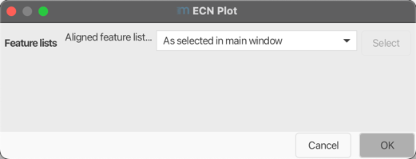

# ECN (Equivalent Carbon Number) models

!!! warning

    This module requires lipid annotations from the [Lipid Annotation module](/docs/module_docs/id_lipid_annotation/lipid-annotation.md)

## Description
:material-menu-open: **Visualization → (Equivalent Carbon Number) plot**

This module groups lipids of the same lipid subclass with the same number of double bond equivalents (DBEs).
Retention time against the number of carbons is plotted for each group to evaluate the annotation quality in context of
the chromatographic behaviour. Trend line and score are added to assist the evaluation.

!!! info

    ECN models are most practicale in combination with reversed phase chromatography. 

## Parameters

#### **Feature List**

Select one feature or aligned feature list.