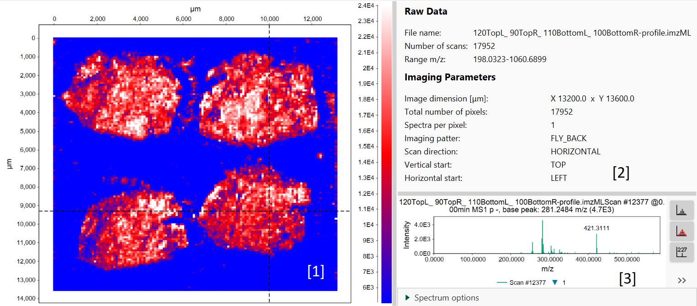

# **Image viewer**

:construction: This module is under active development. Some newer features might not be fully documented.

## **Description**

:material-menu-open: **Visualization  → Image viewer**

This visualization module provides an overview of imaging data.

The interactive imaging plot **[1]** allows to choose any pixel and explore related spectrum. In **[3]** user can choose feature from a feature list to be depicted on a scan (prior feature detection is required).

[2] gives information about file and imaging parameters.

{{ git_page_authors }}