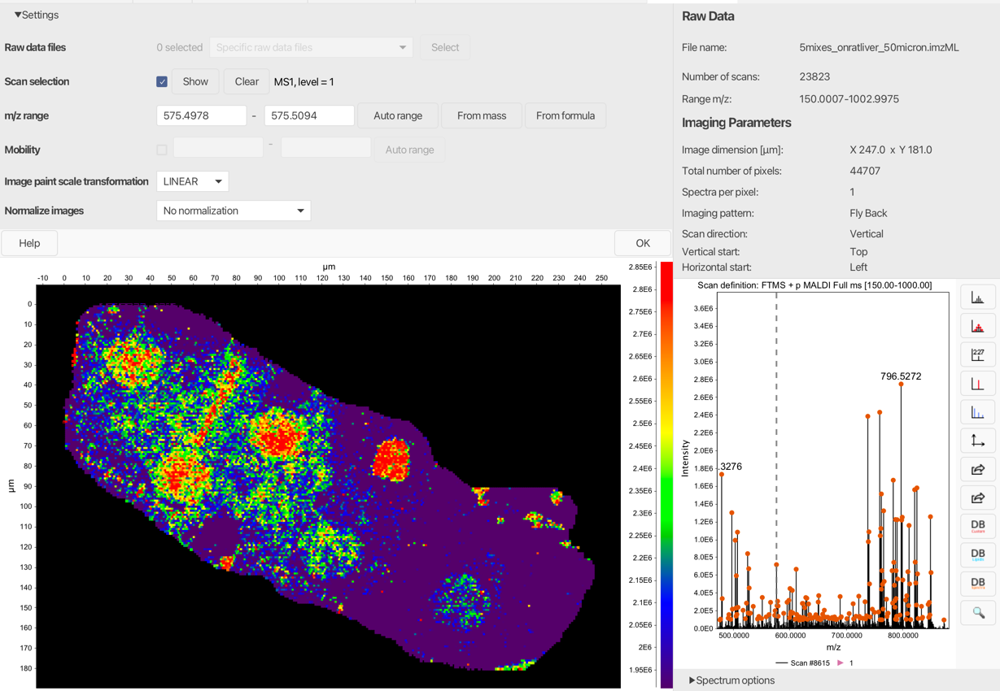
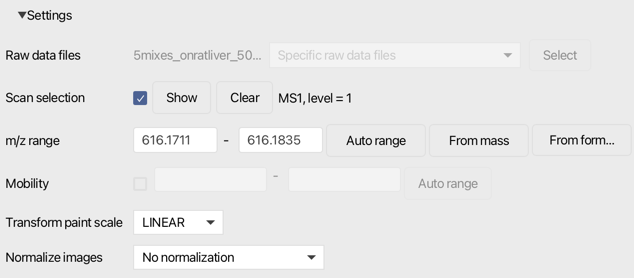

# Image viewer

## Description

:material-menu-open: Visualization  → Image viewer

This visualization module provides an overview of imaging data.

The interactive imaging plot (left) allows to choose any pixel and explore the underlying spectrum (bottom right). When selecting a signal from the spectrum, the corresponding image will be generated. In *Spectrum options* menu, the user can choose a feature from a feature list to be depicted on a scan (prior feature detection is required).

The top right panel gives information about the raw file and imaging parameters used for the acquisition.

!!! tip
    
    The Settings menu on top can be used to change the imaging parameters.

## Parameters and Settings

The following parameters have to be set when running the module. They can be adjusted in the image viewer settings menu.

### Raw data files ###
Select raw data files

### Scan selection ###
Select which scans should be shown in the image. Typical filter for imaging experiments is MS level filter, level = 1. 

### m/z range ###
Define m/z extraction window.

### Mobility ###
Define mobility extraction window if available.

### Transform pain scale ###
Apply a paint scale transformation for the image plot.

### Normalize images ###
Apply image normalization. 

{{ git_page_authors }}