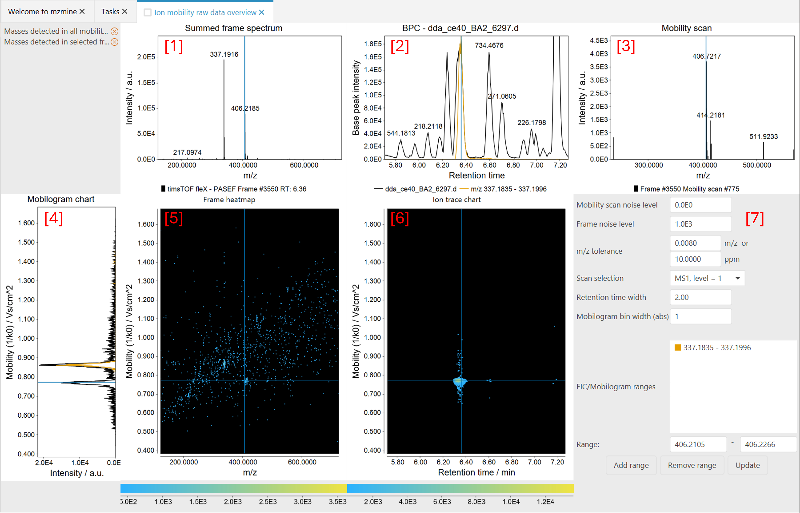

# Ion mobility raw data overview (LC-IMS-MS)

The "Ion mobility raw data visualization" module allow a comprehensive navigation of the complex
LC-IM-MS raw data. The screenshot belows shows an example of LC-IM-MS data acquired with a Bruker
timsTOF instrument:

!!! warning

    If you don't see any data in the Summed frame [1] or BPC panel [2], the IMS raw data was probably imported from an mzml file. IMS-mzmls do not contain accumulated spectra. Therefore, two processing steps are required, before the data can be displayed: [Mass detection for all mobility scans](../../module_docs/featdet_mass_detection/mass-detection.md) and [Mobility scan merging](../../module_docs/featdet_mobility_scan_merging/mobility-scan-merging.md). Both steps are done automatically, if the file is imported through the mzwizard. 

The main window consists of 5 panels and a set of displaying parameters. All the panels are
interconnected, which means that moving the cursor in one panel, automatically updates the others.
Cursors are displayed as light-blue solid lines in the panels.

## Summed frame spectrum panel [1]

The MS spectrum corresponding to
each [frame](../../terminology/ion-mobility-terminology.md#accumulations-mobility-scans-and-frames)
is shown in this panel. The displayed MS spectrum is the sum of all
the [mobility scans](../../terminology/ion-mobility-terminology.md#accumulations-mobility-scans-and-frames)
acquired over that frame (
see [Ion mobility spectrometry terminology](../../terminology/ion-mobility-terminology.md)).

## BPC panel [2]

In this panel,
the [base peak chromatogram](../../terminology/general-terminology.md#base-peak-chromatogram) is
displayed.
Each data point corresponds to an
individual [frame](../../terminology/ion-mobility-terminology.md#accumulations-mobility-scans-and-frames).
Moving the cursor frame-by-frame automatically updates the 'frame heatmap' and 'summed frame
spectrum' panels.
Moving the cursor frame-by-frame automatically updates the 'summed frame spectrum' panels as
changing data point in regular LC-MS data would display a different MS scan.
Since each frame is made of
several [mobily scans](../../terminology/ion-mobility-terminology.md#accumulations-mobility-scans-and-frames),
the 'mobilogram chart' and 'frame heatmap' panels automatically updates too.
_Note_. It is currently not possible to display
the [TIC chromatogram](../../terminology/general-terminology.md#total-ion-current-chromatogram))

Clicking in the chromatogram updates the selected frame.

## Mobility scan [3]

Displays the scan at the current selected mobility value. A scan can be selected by clicking in the
mobilogram plot, the frame heatmap or the ion trace chart.

Clicking in the spectrum updates the selected m/z value.

## Mobilogram chart [4]

Displays the total ion mobilogram at the selected retention time/frame (see frame spectrum) in the
colour of the selected raw data file.
Additional ranges for mobilograms can be added using the displaying parameters.

Clicking in the mobilogram updates the selected mobility value.

## Frame heatmap [5]

Displays the selected frame as a 2D-heatmap. The signal intensity is displayed as a continuous
colour scale.

Clicking in the heatmap updates the selected mobility and m/z values.

## Ion trace chart [6]

Plots the intensity distribution of the selected m/z value along the retention time (domain) and
mobility (range) axes within the currently set **Retention time width** (
see [displaying parameters](#displaying-parameters-6))

## Displaying parameters [6]

Parameters to adjust the visualisation.

**Mobility scan noise level**: This parameter controls the signals shown in
the [Mobility scan panel (3)](#mobility-scan-3) and the [Frame heatmap (5)](#frame-heatmap-5). For
example, a noise level of 5.0E1 will remove signals below this intensity.

**Frame noise level**: This parameter sets a threshold for the signals shown in the [Summed frame
spectrum panel](#summed-frame-spectrum-panel-1).

**m/z tolerance**: A tolerance range for displaying chromatograms, mobilograms, and ion traces of
the selected m/z value.

**Scan selection**: Use this to switch between the selected scans, e.g., MS1 and MS2.

**Retention time width**:
Boundary around the currently selected retention time to build ion traces for the selected m/z.

**Mobilogram bin width (abs)**:
Bins the given number of mobility scans together. Achieves a smoother visualisation.
May be used to manually investigate the effects of altering the bin width in
the 
[IMS expander](../../module_docs/lc-ims-ms_featdet/featdet_ims_expander/ims-expander.md#override-default-mobility-bin-width-scans)
to also achieve smoother mobilograms during feature detection.

**EIC/mobilogram ranges**:
Manually add m/z ranges that are visualised constantly. Either define a range, or just define the
center of the range and click add. In the latter case, the **m/z tolerance** is used around the
given
m/z.
