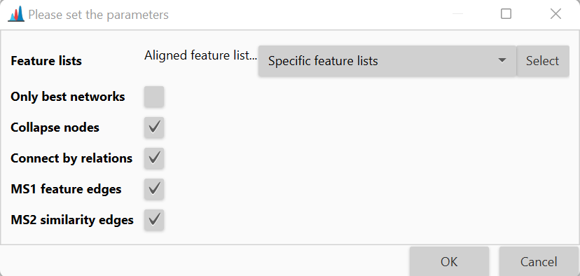

# **Interactive ion identity molecular networks**

## **Description**

:material-menu-open: **Visualization  → Interactive ion identity molecular networks**

Molecular networking connects mass spectra of molecules based on the similarity of their fragmentation patterns. However, during ionization, molecules commonly form multiple ion species with different fragmentation behavior. As a result, the fragmentation spectra of these ion species often remain unconnected in tandem mass spectrometry-based molecular networks, leading to redundant and disconnected sub-networks of the same compound classes. 

To overcome this bottleneck, MZmine employes **Ion Identity Molecular Networking (IIMN)** module. This module unites chromatographic peak shape correlation analysis with molecular networks, which is able to connect and collapse different ion species of the same molecule. This feature relationships improve network connectivity for structurally related molecules.

This module can be used to reveal unknown ion-ligand complexes, enhance annotation within molecular networks, and facilitate the expansion of spectral reference libraries. 

:material-lightbulb: Using IIMN it is possible to query [GNPS](https://gnps.ucsd.edu/ProteoSAFe/libraries.jsp) and other spectral libraries for matches.

More detailed description of theory behind IIMN can be found in the following video:

<iframe width="560" height="315" src="https://www.youtube.com/embed/YzMBx_oSvb0" title="YouTube video player" frameborder="0" allow="accelerometer; autoplay; clipboard-write; encrypted-media; gyroscope; picture-in-picture" allowfullscreen></iframe>

## **Parameters**

#### **Only best networks**

Only the networks that only contain first ranked ion identities for all rows.

#### **Collapse nodes**

Collapse all nodes into neutral molecule nodes. 

#### **Connect by relations**

Connect neutral molecule nodes by network relations. 

#### **MS1 feature edges**

Include feature correlation edges.

#### **MS2 similarity edges**

Show MS2 similarity edges.