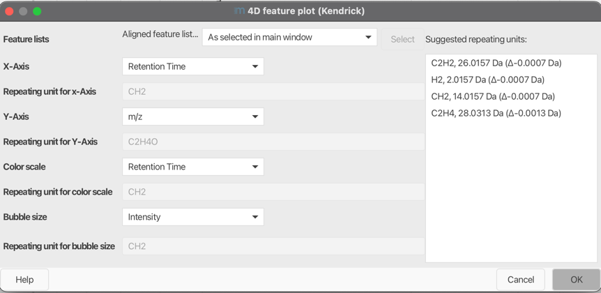

# **4D features plot (Kendrick mass plot)**

## **Description**

:material-menu-open: **Visualization → 4D features plot (Kendrick)**

In 1963 Kendrick published his idea of a mass scale, the so-called Kendrick mass scale, which is
based on defining the mass of CH2 as 14.0000 u.

The Kendrick mass scale is calculated by multiplying the IUPAC mass scale with the factor 14.0000
u/14.01565 u = 0.9988834. This results in the same mass defect for homologous components, the
so-called **Kendrick mass defect (KMD)**. The KMD is defined as the \(\Delta\) of a nominal Kendrick
mass and its associated Kendrick mass. Using the Kendrick mass scale has the purpose of data
reduction.

\[KM(R)=m/z\cdot\frac{round(R)}{R}\]

\[KMD(R)=round(KM(R))-KM(R)\]

where \(KM\) is Kendrick mass, \(KMD\) - Kendrick mass defect, \(R\) - exact mass of selected base
unit.

If you use this module for your analysis or visualization, please cite:

!!! quote " "

    Three‐dimensional Kendrick mass plots as a tool for graphical lipid identification. A. Korf, C. Vosse, R. Schmid, P. O. Helmer, V. Jeck, H. Hayen, Rapid Communications in Mass Spectrometry 32.12 (2018): 981-991.

    Expanding the Kendrick Mass Plot Toolbox in MZmine 2 to Enable Rapid Polymer Characterization in Liquid Chromatography−Mass Spectrometry Data Sets A. Korf, T. Fouquet, R. Schmid, H. Hayen, and S. Hagenhoff, Analytical Chemistry 2020 92 (1), 628-633.

## **Detailed functionality**

This module allows to create 4 dimensional Kendrick mass plots. Feature characteristics, such as
retention time or feature area, can be plotted as color scale or bubble size.

### **Charge dependent Kendrick mass plots**

Multiply charged ions can cause splits in Kendrick mass plot. Fouquet et al. have shown considering
the charge for the calculation of the KM can help to overcome this problem through clustering of
features.

\[KM(R,Z)=Z\cdot KM(R)=Z\cdot m/z\cdot \frac{round(R)}{R}\]

where \(Z\) is charge.

!!! quote " "

    Fouquet, Thierry NJ, et al. "On the Kendrick Mass Defect Plots of Multiply Charged Polymer Ions: Splits, Misalignments, and How to Correct Them." Journal of The American Society for Mass Spectrometry 29.8 (2018): 1611-1626.

### **Resolution enhanced Kendrick mass defect plots**

Fouquet and Sato have shown that a fractional base unit (ivisor) can enhance the resolution of
Kendrick mass plots.

\[X>1, KM(R,X)=m/z\cdot \frac{round(R/X)}{R/X}\]

where \(X\) is a fractional base unit.

!!! quote " "

    Fouquet, Thierry, and Hiroaki Sato. "Extension of the Kendrick mass defect analysis of homopolymers to low resolution and high mass range mass spectra using fractional base units." Analytical chemistry 89.5 (2017): 2682-2686.

### **Combining charge and fractional base unit (Divisor)**

If both charge and fractional base unit are changed, the following equation is used:

\[KM(R,Z,X)=Z\cdot KM(RX)=Z\cdot m/z\cdot \frac{round(R/X)}{R/X}\]

!!! quote " "

    Fouquet, Thierry NJ, et al. "On the Kendrick Mass Defect Plots of Multiply Charged Polymer Ions: Splits, Misalignments, and How to Correct Them." Journal of The American Society for Mass Spectrometry 29.8 (2018): 1611-1626.

    Fouquet, Thierry, Takaya Satoh, and Hiroaki Sato. "First gut instincts are always right: the resolution required for a mass defect analysis of polymer ions can be as low as oligomeric." Analytical chemistry 90.4 (2018): 2404-2408.

### **Remainders of Kendrick masses (RKM)**

Another option to increase the resolution of Kendrick mass plots is the by Fouquet et al. proposed
concept of RKM (remainders of Kendrick masses).
\[RKM(R)=\Bigg\{\frac{KM(R)}{round(R)}\Bigg\}\]

with \(\{ \}\) being the fractional part function defined as \(x=x-floor(x)\)

## **Parameters**

#### **Feature List**

Select one feature or aligned feature list.

#### **X-axis**

Select which metric you want to display on the X-Axis. Possible metrics are m/z, Kendrick Mass,
Kendrick Mass Defect, Remainder of Kendrick Mass, Retention Time, Mobility, Intensity, Area, Tailing
Factor, and Asymetry Factor.

#### **Repeating unit for X-Axis**

Enter a molecular formula which will be used for Kendrick Mass calculation. The field is only acitve
if Kendrick, Kendrick Mass Defect, or Remainder of Kendrick Mass is selected.

#### **Y-axis**

Select which metric you want to display on the Y-Axis. Possible metrics are m/z, Kendrick Mass,
Kendrick Mass Defect, Remainder of Kendrick Mass, Retention Time, Mobility, Intensity, Area, Tailing
Factor, and Asymetry Factor.

#### **Repeating unit for Y-Axis**

Enter a molecular formula which will be used for Kendrick Mass calculation. The field is only acitve
if Kendrick, Kendrick Mass Defect, or Remainder of Kendrick Mass is selected.

#### **Color scale**

Select which metric you want to display as a color scale. Possible metrics are m/z, Kendrick Mass,
Kendrick Mass Defect, Remainder of Kendrick Mass, Retention Time, Mobility, Intensity, Area, Tailing
Factor, and Asymetry Factor.

#### **Repeating unit for color scale**

Enter a molecular formula which will be used for Kendrick Mass calculation. The field is only acitve
if Kendrick, Kendrick Mass Defect, or Remainder of Kendrick Mass is selected.

#### **Bubble size**

Select which metric you want to display as bubble size. Possible metrics are m/z, Kendrick Mass,
Kendrick Mass Defect, Remainder of Kendrick Mass, Retention Time, Mobility, Intensity, Area, Tailing
Factor, and Asymetry Factor.

#### **Repeating unit for bubble size**

Enter a molecular formula which will be used for Kendrick Mass calculation. The field is only acitve
if Kendrick, Kendrick Mass Defect, or Remainder of Kendrick Mass is selected.

## Region of interest ROI extraction

The Kendrick/4D plot can be used to extract regions of interest from a plot. E.g., you can use this
to extract polymers, PFAS, Lipids and more depending on their localization in a m/z vs. RT plot or
in a Kendrick plot.

1. Find the "Region" panel below the kendrick plot 
2. Start drawing by pressing the "Start" button.
3. Draw your region of interest in the plot. Unfinished ROIs will be filled in
   gray. 
4. Finish drawing the region by pressing the "Finish" button. The finished region will just be
   outlined. 
5. Click the "Extract to feature list" button to create a new feature list of features in this
   region.

!!! Note: The chart supports multiple regions. Region drawing can be canceled, regions can be
removed or loaded and saved using the respective buttons.

!!! Batch mode: To use the ROI extraction in the batch mode, set up the desired ROI using the 4D
chart and save the region or extract it. You can either save the whole batch from the feature list
summary or load the regions into the 'Region extraction' module.

## **Automatic Repeating Unit Suggestion**

### **Description**

The `Repeating Unit Suggester` in mzmine is designed to automatically predict repeating units based
on the m/z values of features in a feature list.
This functionality is crucial for simplifying the identification of repeating units in polymer
analysis,
lipid identification, and other applications requiring pattern recognition in mass spectrometry
data.

### **Functionality**

The `Repeating Unit Suggester` performs the following steps to suggest repeating units. The results
are displayed on the right side of the [parameter setup dialog](#parameters):

1. **Extract m/z Values**: The m/z values are extracted from the provided feature list, taking into
   account the detected charge states of the features, if available (default charge = 1).

2. **Calculate Delta Frequencies**: The frequency of all m/z deltas is calculated to identify common
   mass differences between features.

3. **Identify Top Deltas**: The top N delta medians are identified based on their frequency, which
   helps in pinpointing the most common repeating units.

4. **Filter Multimers**: The deltas are filtered to remove multimers, ensuring that only the most
   relevant repeating units are considered.

5. **Predict Formulas**: Potential molecular formulas corresponding to the identified deltas are
   predicted. This involves:
    - Generating molecular formulas.
    - Applying heuristic checks (RDBE, elemental, and nitrogen rule) to validate the predicted
      formulas.
