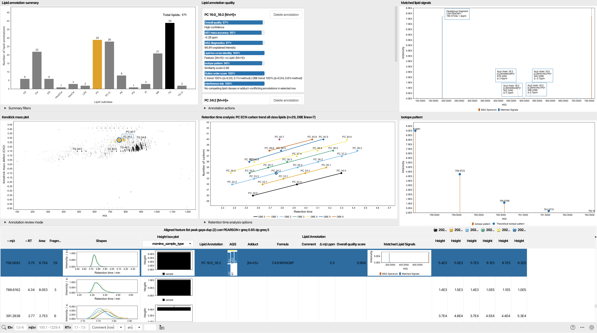
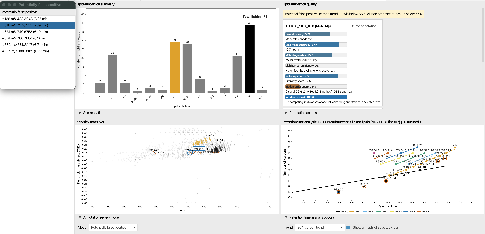

# Lipid Annotation Quality Control Dashboard

!!! warning

    This dashboard requires lipid annotations in the selected feature list.

## Description

:material-menu-open: **Visualization → Lipid annotation quality control dashboard**

The lipid annotation quality control dashboard brings together the most important review tools for annotated feature lists in a single interactive workspace. It is designed for checking annotation quality, spotting false positives and false negatives, comparing isotope patterns, validating MS/MS evidence, and cleaning duplicate annotations without leaving the feature list.

The dashboard is split into six linked panels plus the feature table at the bottom. Selecting a row in one place updates the other panes, so the whole view stays synchronized while you review and clean annotations.

## What You Can See

### Lipid Annotation Summary

The summary panel at the upper left shows a bar chart of the annotated lipid distribution. By default, lipids are grouped by lipid subclass, but you can regroup them by lipid main class or lipid category.

You can also switch between counting:

- all feature-list rows that carry lipid annotations
- unique annotation identities

The chart is interactive. Clicking one or more bars filters the rest of the dashboard to the selected group or groups. A `Clear filter` button resets the selection.

The `Preferred level` selector controls whether the dashboard treats annotations as species-level or molecular-species-level labels when it builds group names and tooltips.

### Kendrick Mass Plot

The Kendrick mass plot visualizes annotated lipids in an m/z versus Kendrick mass defect view. In this dashboard it is used as a review surface rather than just a static plot:

- points are colored by retention time
- point size reflects intensity
- the selected lipid is highlighted
- clicking a point jumps to the corresponding feature-list row

The `Annotation review mode` control lets you overlay candidates for:

- `None`
- `Potentially false positive`
- `Potentially false negative`

When a review mode is enabled, the dashboard highlights suspicious rows and opens a small outlier list that can be used to jump directly to candidates.

### Lipid Annotation Quality

This pane is the main inspection and cleanup area. Each annotation is shown as a card with a bar-style breakdown of the score components.

For each annotation you can inspect:

- overall quality
- MS1 mass accuracy
- MS2 diagnostics
- lipid ion versus ion-identity agreement
- isotope pattern score
- elution-order score, if retention-time analysis is enabled
- interference risk from competing annotations

The panel also shows warnings when something looks suspicious, such as:

- potential interference from other annotations in the same row
- a potential false positive
- a potential false negative
- identical overall scores for two isomeric candidates

Each annotation card includes a `Delete annotation` button. If the dashboard detects a likely missed annotation, it shows an additional card with an `Add annotation` button so you can promote the candidate into the feature list.

If the same annotation appears on multiple rows, the dashboard shows links to the other rows and offers two cleanup actions:

- `Delete selected`
- `Delete others`

There is also an `Annotation actions` section with a `Remove multi-row annotations` command for dedicated duplicate cleanup across rows.

### Retention Time Analysis

The retention-time pane is enabled for LC-based analyses and disabled for direct infusion or imaging workflows. It helps validate whether the lipid follows the expected elution behavior.

The available trend modes are:

- equivalent carbon number trend
- DBE trend
- combined carbon and DBE trends

The control row lets you:

- choose the trend mode
- show all lipids of the selected class
- focus on the selected annotation only

Clicking a point in the plot selects the corresponding feature-list row. The plot also highlights potential false positives and false negatives when review overlays are active.

### Matched Lipid Signals

This pane shows the MS2 evidence for the selected row.

If the row contains a confident lipid match with fragment evidence, the dashboard displays the annotated spectrum with matched signals marked directly on the plot. If there is no confident match, it falls back to the raw representative MS2 spectrum for that row.

This makes it easy to confirm whether the observed fragments support the annotation.

### Isotope Pattern

The isotope panel compares the measured isotope pattern to the theoretical pattern derived from the selected annotation.

This is useful for checking:

- whether the measured isotope envelope matches the candidate
- whether the selected adduct and formula are chemically plausible
- whether the row has a clean MS1 isotope fit before you trust the MS2 evidence

### Feature Table

The bottom section contains the feature table itself. It is the central control surface of the dashboard.

From the table you can:

- select rows to update all dashboard panes
- inspect annotation-related columns such as lipid annotation, adduct, formula, comment, mass error, overall quality score, and matched lipid signals
- sort and filter rows while keeping the dashboard synchronized

The selected row is highlighted in the table and in the other panes, so you can move between the global summary and the row-level evidence without losing context.

## Typical Review Workflow

1. Use the summary chart to narrow the dashboard to one lipid group.
2. Inspect the Kendrick plot for suspicious clusters or outliers.
3. Open the quality cards for the selected row and check the score breakdown.
4. Validate the MS2 spectrum and isotope pattern.
5. If needed, use the retention-time pane to confirm the elution trend.
6. Remove obvious duplicates or promote a likely false negative candidate back into the feature list.

## Related Pages

- [Lipid annotation](../../module_docs/id_lipid_annotation/lipid-annotation.md)
- [Lipid annotation summary](../lipid_annotation_summary/lipid_annotation_summary.md)
- [ECN models](../ecn_plots/ecn_plots.md)

