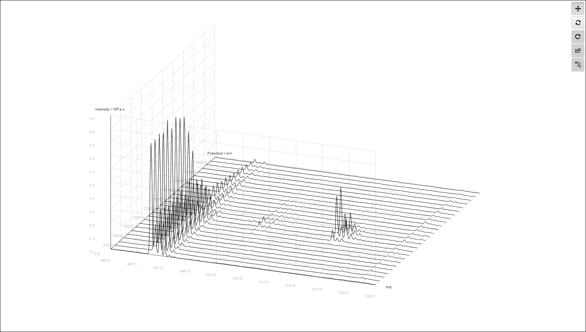
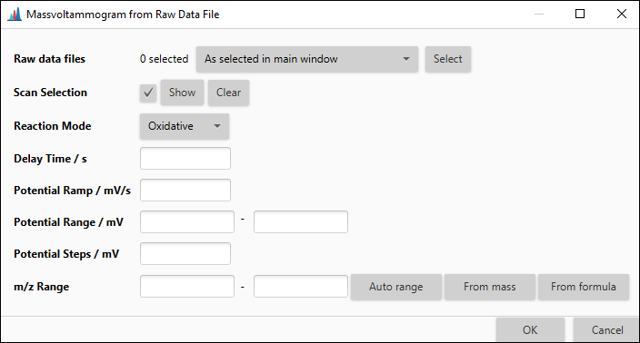

# Massvoltammogram
## Electrochemistry/Mass Spectrometry
The hyphenation of electrochemistry (EC) and mass spectrometry (MS) is an analytical technique for the instrumental simulation of the human metabolism.
By applying an electric potential to an electrochemical cell, that contains the analyte solution, it is possible to generate transformation products.
These transformation products often closely resemble *in vivo*-metabolites.
[1,2]

The applied potential is ramped in a given range to detect transformation products formed at different potentials.
For an easy identification of the generated transformation products the collected data is  often shown in so-called mass voltammograms.
These mass voltammograms are three-dimensional plots in which mass spectra are shown in dependence of the corresponding applied potential.
Using a mass voltammogram it is very easy to observe the different transformation products generated at different applied potentials.
[3,4]

## Description

:material-menu-open: **Visualization → Massvoltammogram**

The "massvoltammogram" module allows the visualisation of EC/MS-data in the form of mass voltammograms. 
The screenshot below shows a mass voltammogram generated with MZmine3. 
Mass voltammograms can be generated directly from the raw data files without the need for any other processing steps. 
Otherwise ist is also possible to create mass voltammograms from processed feature lists.

The mass voltammogram can be moved and rotated via the first two buttons in the toolbar and scaled by using the mouse wheel.
The third button in the toolbar can be used to reset the view.
By right-clicking on any given point in the mass voltammogram the points exact coordinates are shown.
Furthermore the range of shown *m*/*z*-values can be readjusted by pressing the "*m*/*z*"-button in the toolbar .

To export the mass voltammogram the second-last button in the toolbar needs to be pressed. 
There are two file formats available.
The mass voltammogram can be exported as an image to a png-file or all mass spectra in the mass voltammogram can be exported to single csv-files.

## Parameter

### From raw data file

:material-menu-open: **Visualization → Massvoltammogram → From Raw Data File**

This module generates the mass voltammogram from a raw data file.

**Raw data files**

The raw data file of the EC/MS-experiment the mass voltammogram will be generated from.

**Scan Selection**

The scan selection filter used to define the scan types to be used for the generation of the mass voltammogram.
For example is it possible to select the MS level or the ion polarity.

### From feature list

:material-menu-open: **Visualization → Massvoltammogram → From Feature List**

This module generates the mass voltammogram from a feature list.

**Feature lists**

The feature list the mass voltammogram will be generated from.

### General Parameter

The following parameter are the same whether the mass voltammogram will be created from a raw data file or a feature list.

**Reaction Mode**

The mode the electrochemical cell was used in, whether oxidative or reductive.

**Delay Time**

The delay time in s between the generation of the transformation products and their detection in the mass spectrometer.

**Potential Ramp**

The speed in mV s-1 the applied potential is ramped at.

**Potential Range**

The potential range of the applied potential ramp in mV.

**Potential Steps**

The potential step size in mV between the mass spectra that are shown in the mass voltammogram.

**m/z Range**

The range of *m*/*z*-values to be shown in the mass voltammogram.

## References

<!-- markdown-link-check-disable-next-line -->
[1] [A. Baumann, U. Karst, Expert. *Opin. Drug. Metab. Toxicol.* **2010**, *6*, 715–731.](https://doi.org/10.1517/17425251003713527) 
<!-- markdown-link-check-disable-next-line -->
[2] [W. Lohmann, U. Karst, *Anal. Bioanal. Chem.* **2008**, *391*, 79–96](https://pubs.acs.org/doi/10.1021/ac071100r) 
<!-- markdown-link-check-disable-next-line -->
[3] [H. Faber, M. Vogel, U. Karst, *Anal. Chim. Acta.* **2014**, *834*, 9–21.](https://doi.org/10.1016/j.aca.2014.05.017)  
<!-- markdown-link-check-disable-next-line -->
[4] [T. Herl, F.-M. Matysik, *ChemElectroChem.* **2020**, *7*, 2498–2512.](https://chemistry-europe.onlinelibrary.wiley.com/doi/10.1002/celc.202000442) 