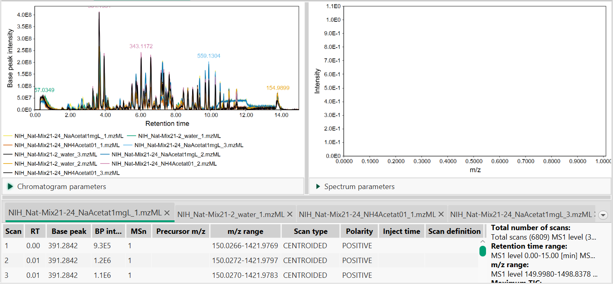
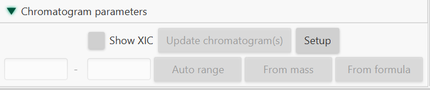

# **Raw data overview (LC-MS)**

Raw data overview allows user to explore both chromatogram and MS views across all the selected files. If the several files are chosen, they will be displayed in one plot.

The view consists of three panes - chromatogram representation (on the left), mass spectrum (on the right), and table with tabs containing additional information about raw data files.

### **Chromatogram parameters**

**Show XIC**

To display an XIC view of chromatograms in a defined m/z range user can tick an option "Show XIC". m/z range can be either defined manually or generated automatically.

"Setup" button allows to choose appropriate plot type. **Base peak intensity** plot shows the peaks with the greatest intensity while **TIC** plot shows the sum of all the separate ion currents.

### **Spectrum parameters**

When masses are detected, it is possible to display them on the spectrum by ticking an option "Show mass list".

## **Chromatogram plot**

### **Description**

There is a possibility to display chromatographic peaks outside of raw data overview. This standalone two-dimensional plot visualizes TIC/XIC data. All the chromatograms are displayed in the same plot.

The x-axis corresponds to retention time and the y-axis is the intensity level of the signal. 

### **Parameters**

**Raw data files**

List of raw data files to display in the TIC visualizer. 

**MS level**

Scan level (MS1,MS2,... ,MSn) to display in the plot.

**Plot type**

TIC or base peak 

**Retention time**

Retention time (x-axis) range.

**m/z range**

Range of m/z values. If this range does not include the entire scan m/z range, the resulting visualizer is XIC type.

**Selected peaks**

List of chromatographic peaks to display in the TIC visualizer. This option is available only if a peak list related to the selected raw data file exists in the current project.

# **MS spectrum**

Displays all the ions from a selected scan. Can be used to explore mass spectrum outside of raw data overview. 
**Only one** raw file can be chosen. 

It shows a plot of two dimensions, where X axis corresponds to m/z value and Y axis is the intensity of the ion signal.

### **Parameters**

**Scan number**

Choose the scan to visualize

TODO: Describe MS plot window

## Page Contributors

{{ git_page_authors }}
