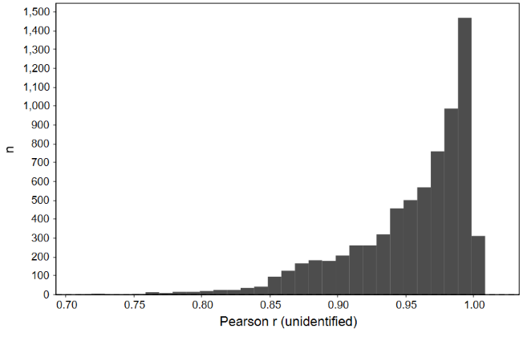
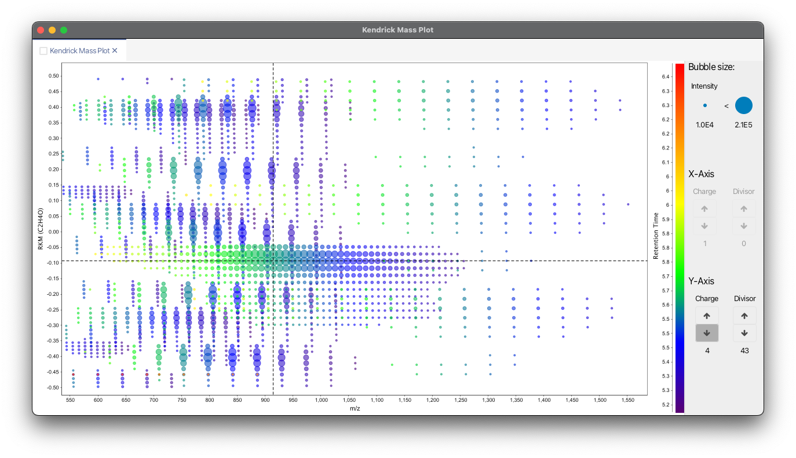
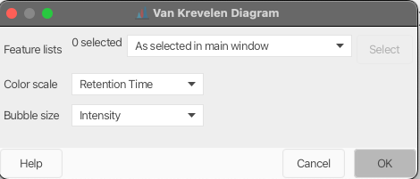

## **Scatter plot**

[//]: # (TODO Rename )
### **Description**

:material-menu-open: **Visualization  → Scatter plot**

This tool shows a scatter plot with data from identified peaks in aligned feature list.

A search for a peak can be done using three options (name, retention time and m/z value).

[//]: # (TODO Add parameters and screenshot)

## **Correlated features $\Delta$m/z histogram**

### **Description**

:material-menu-open: **Visualization  → Correlated features $\Delta$m/z histogram**

This module plots all m/z deltas between correlated features in a histogram and offers a Gaussian fit.

### **Parameters**

#### **Minimum Pearson correlation**

Minimum Pearson correlation of feature shapes.

#### **Limit delta to m/z**

Maximum m/z delta is the m/z of the smaller ion (feature list row).

#### **m/z bin width**

Binning of m/z values for feature picking

#### **Append to file**

Append the correlated features delta m/z to a csv file.

[//]: # (TODO Add screenshot)

## **Correlation coefficient histogram**

### **Description**

:construction: This module is being updated. Some newer functionality might not be documented.

This module allows to plot all correlations between feature shapes.

### **Parameters**

#### **m/z bin width**

Binning of m/z values for feature picking

## **Feature intensity plot**

### **Description**

:construction: This module has a known bug and is being updated, which might affect its functionality.

:material-menu-open: **Visualization → Feature intensity plot**

This plot allows to explore specific features against the raw data.

[//]: # (TODO)

### **Parameters**

#### **Data files**

Selects the raw data files from where the peaks were detected

#### **X axis value**

X axis display the raw data file name or the parameter defined in the "set sample parameters" window

#### **X axis value**

The user can choose from peak's height, area or retention time value to display in this axis.

#### **Peaks**

The user can select the peaks to use in this plot.

## **Kendrick mass plot**

### **Description**

:material-menu-open: **Visualization → Kendrick mass plot**

In 1963 Kendrick published his idea of a mass scale, the so-called Kendrick mass scale, which is based on defining the mass of CH2 as 14.0000 u.

The Kendrick mass scale is calculated by multiplying the IUPAC mass scale with the factor 14.0000 u/14.01565 u = 0.9988834. This results in the same mass defect for homologous components, the so-called **Kendrick mass defect (KMD)**. The KMD is defined as the \(\Delta\) of a nominal Kendrick mass and its associated Kendrick mass. Using the Kendrick mass scale has the purpose of data reduction.

\[KM(R)=m/z\cdot\frac{round(R)}{R}\]

\[KMD(R)=round(KM(R))-KM(R)\]

where \(KM\) is Kendrick mass, \(KMD\) - Kendrick mass defect, \(R\) - exact mass of selected base unit.

If you use this module for your analysis or visualization, please cite:

!!! quote " "

    Three‐dimensional Kendrick mass plots as a tool for graphical lipid identification. A. Korf, C. Vosse, R. Schmid, P. O. Helmer, V. Jeck, H. Hayen, Rapid Communications in Mass Spectrometry 32.12 (2018): 981-991.

    Expanding the Kendrick Mass Plot Toolbox in MZmine 2 to Enable Rapid Polymer Characterization in Liquid Chromatography−Mass Spectrometry Data Sets A. Korf, T. Fouquet, R. Schmid, H. Hayen, and S. Hagenhoff, Analytical Chemistry 2020 92 (1), 628-633.

### **Detailed functionality**

This module allows to create 4 dimensional Kendrick mass plots. Feature characteristics, such as retention time or feature area, can be plotted as color scale or bubble size.

#### **Charge dependent Kendrick mass plots**

Multiply charged ions can cause splits in Kendrick mass plot. Fouquet et al. have shown considering the charge for the calculation of the KM can help to overcome this problem through clustering of features.

\[KM(R,Z)=Z\cdot KM(R)=Z\cdot m/z\cdot \frac{round(R)}{R}\]

where \(Z\) is charge.

!!! quote " "

    Fouquet, Thierry NJ, et al. "On the Kendrick Mass Defect Plots of Multiply Charged Polymer Ions: Splits, Misalignments, and How to Correct Them." Journal of The American Society for Mass Spectrometry 29.8 (2018): 1611-1626.

#### **Resolution enhanced Kendrick mass defect plots**

Fouquet and Sato have shown that a fractional base unit (ivisor) can enhance the resolution of Kendrick mass plots.

\[X>1, KM(R,X)=m/z\cdot \frac{round(R/X)}{R/X}\]

where \(X\) is a fractional base unit.

!!! quote " "

    Fouquet, Thierry, and Hiroaki Sato. "Extension of the Kendrick mass defect analysis of homopolymers to low resolution and high mass range mass spectra using fractional base units." Analytical chemistry 89.5 (2017): 2682-2686.

#### **Combining charge and fractional base unit (Divisor)**

If both charge and fractional base unit are changed, the following equation is used:

\[KM(R,Z,X)=Z\cdot KM(RX)=Z\cdot m/z\cdot \frac{round(R/X)}{R/X}\]

!!! quote " "

    Fouquet, Thierry NJ, et al. "On the Kendrick Mass Defect Plots of Multiply Charged Polymer Ions: Splits, Misalignments, and How to Correct Them." Journal of The American Society for Mass Spectrometry 29.8 (2018): 1611-1626.

    Fouquet, Thierry, Takaya Satoh, and Hiroaki Sato. "First gut instincts are always right: the resolution required for a mass defect analysis of polymer ions can be as low as oligomeric." Analytical chemistry 90.4 (2018): 2404-2408.

#### **Remainders of Kendrick masses (RKM)**

Another option to increase the resolution of Kendrick mass plots is the by Fouquet et al. proposed concept of RKM (remainders of Kendrick masses). 
\[RKM(R)=\Bigg\{\frac{KM(R)}{round(R)}\Bigg\}\]

with \(\{ \}\) being the fractional part function defined as \(x=x-floor(x)\)

### **Parameters**

#### **Feature List**

Select one feature or aligned featurel list.

#### **X-axis**

Select which metric you want to display on the X-Axis. Possible metrics are m/z, Kendrick Mass, Kendrick Mass Defect, Remainder of Kendrick Mass, Retention Time, Mobility, Intensity, Area, Tailing Factor, and Asymetry Factor.

#### **Repeating unit for X-Axis**

Enter a molecular formula which will be used for Kendrick Mass calculation. The field is only acitve if Kendrick, Kendrick Mass Defect, or Remainder of Kendrick Mass is selected.

#### **Y-axis**

Select which metric you want to display on the Y-Axis. Possible metrics are m/z, Kendrick Mass, Kendrick Mass Defect, Remainder of Kendrick Mass, Retention Time, Mobility, Intensity, Area, Tailing Factor, and Asymetry Factor.

#### **Repeating unit for Y-Axis**

Enter a molecular formula which will be used for Kendrick Mass calculation. The field is only acitve if Kendrick, Kendrick Mass Defect, or Remainder of Kendrick Mass is selected.

#### **Color scale**

Select which metric you want to display as a color scale. Possible metrics are m/z, Kendrick Mass, Kendrick Mass Defect, Remainder of Kendrick Mass, Retention Time, Mobility, Intensity, Area, Tailing Factor, and Asymetry Factor.

#### **Repeating unit for color scale**

Enter a molecular formula which will be used for Kendrick Mass calculation. The field is only acitve if Kendrick, Kendrick Mass Defect, or Remainder of Kendrick Mass is selected.

#### **Bubble size**

Select which metric you want to display as bubble size. Possible metrics are m/z, Kendrick Mass, Kendrick Mass Defect, Remainder of Kendrick Mass, Retention Time, Mobility, Intensity, Area, Tailing Factor, and Asymetry Factor.

#### **Repeating unit for bubble size**

Enter a molecular formula which will be used for Kendrick Mass calculation. The field is only acitve if Kendrick, Kendrick Mass Defect, or Remainder of Kendrick Mass is selected.

## Van Krevelen diagram
### Description
**Van Krevelen diagrams** are graphical plots developed by Dirk Willem van Krevelen (chemist and professor of fuel technology at the TU Delft) that are used to assess the origin and maturity of kerogen and petroleum.

The diagram cross-plots the hydrogen:carbon (hydrogen index) as a function of the oxygen:carbon (oxygen index) atomic ratios of carbon compounds.
!!! quote " "
1. Van Krevelen, D.W. (1950). "Graphical-statistical method for the study of structure and reaction processes of coal", Fuel, 29, 269-84
2. https://en.wikipedia.org/wiki/Van_Krevelen_diagram

!!! warning

    Since element ratios are plotted only annotated features are considered. 

### Parameters

#### Feature lists
Select feature list to display as Van Krevelen diagram.

#### Color scale
Select which parameters you want to display as a color scale.

#### Bubble size
Select which parameters you want to display as bubble size.

{{ git_page_authors }}

