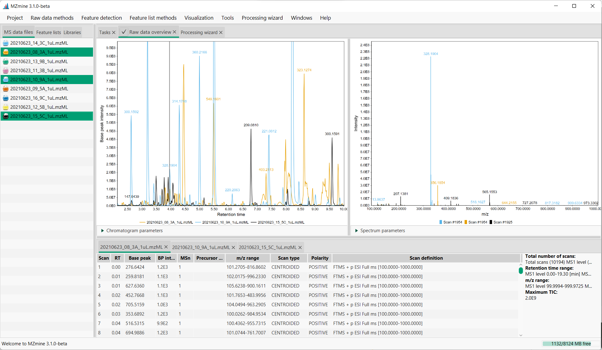

# **Raw data overview (LC-MS)**

## **Description**

:material-menu-open: **Visualization → Raw data overview**, or it can be accesed by **double-click of left mouse button**, or by clicking the right mouse button on **MS data files** table and choosing :material-menu-open: **Show raw data overview**

[//]: # (TODO Add the same level of detalization for each menu item in data table and feature table)

Raw data overview allows user to explore both chromatogram and MS views across all the selected files. By double-clicking on the raw file of interest in the "MS data files" tab, **Raw data overview** tab will open in the main content pane. Raw data overview can either display single or multiple overlaid chromatograms, depending on how many raw files are selected.

:material-lightbulb: To allow selection of multiple raw files, click the checkbox near the tab name "Raw data overview".

The view consists of three panes - chromatogram representation (on the left), mass spectrum (on the right), and table with tabs containing additional information about raw data files.

## **Chromatogram parameters**

**Show XIC**

To display an extracted ion chromatogram (XIC), the user can tick the "Show XIC" box. There are several options for defining the m/z range - from mass, from formula and auto range. 

"Setup" button allows to choose the appropriate plot type. **Base peak intensity** plot only shows the signal of the most intense mass peak in each MS spectrum, while the **Total ion current** plot shows the summed signal intensity of all masses at any one retention time point.

## **Spectrum parameters**

When masses are detected, it is possible to display them on the spectrum by ticking an option "Show mass list".

## Page Contributors

{{ git_page_authors }}
