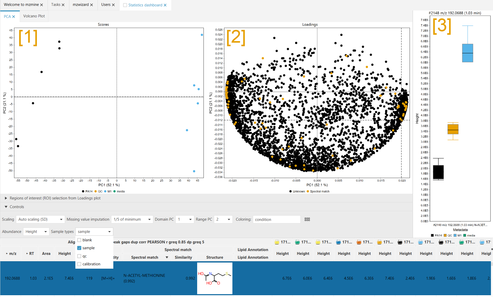
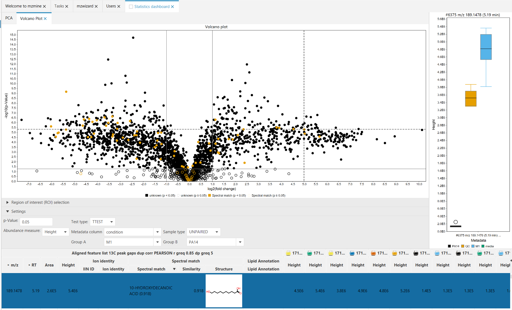

# Statistics dashboard

The statistics dashboard gives you an overview of your dataset. The statistical insight is directly linked to the raw features, giving you direct access to the significant differences in your samples. Nevertheless, the dashboard is not meant to substitute downstream statistical analysis.

!!! Warning

    The description here will be held in simple terms. For a more in-depth description refer to other sources.

!!! info

    Both plots allow ROI selection, allowing you to extract the area of the most significant features into a new feature list.

## Principal component analysis (PCA)

### Plot description

Principal component analysis is a type of unsupervised, multivariate statistics, meaning multiple variables (here features) are analysed for each observation (sample/data file).
The PCA will find features that show the most variance in your sample set and then cluster your samples based on the abundance of the features.

The PCA consists of two plot, the Scores plot [1] and the Loadings plot [2]. The scores plot shows how your samples (= data files) have been clustered by the PCA. Each dot represents a single data file.
The loadings plot shows how "*responsible*" the features are for the clustering. Each dot represents a single row (= multiple features across all your samples).
 
Notice the identical axis titles in the Scores and Loadings plot. In general this means that features with a high x-axis value in the Loadings plot are responsible for shifting the data files in the scores plot towards high x-axis values. (The same counts for the y-axis)

As seen in the screenshot, a feature on the right side of the loadings plot is selected. The scores plot shows that the "M1" group samples (blue) are located on the right. The bar chart [3] shows that the selected feature is upregulated on the in the "M1" group (blue) and downregulated in the "PA14" group (black), which is shifted to the left in the Scores plot [1].

### Controls

**Scaling** Defines how the intesities of features are scaled before the PCA. All scaling methods perform mean-centering prior to scaling. **Auto scaling** scales by the standard deviation in a row and is the most common scaling method. **Range scaling** scales all features to values between -1 and 1, meaning every feature is equally important for the grouping. **Pareto scaling** scales by the square root of the standard deviation of the intensity in a row. This is common in metabolomics, but puts more emphasis ob the absolute intensity than auto scaling.

**Missing values imputations**: Defines how missing values (= no feature detected) are handled. Since missing values are not allowed in PCAs, they must be replaced by something. **1/5 of  minimum** assumes that the detector was not sensitive enough to detect something, but that there may be something below the LOD. **Zero** imputes missing values with 0 (less common).

**Domain PC** and **Range PC** define the axis in the plots. The dimensionality reduction by PCA creates more than one possible projections. In your dataset, more than principle component (PC)1 and PC2 may be relevant. The PCs are sorted by how much of the variance they expain in your dataset.

**Coloring** Selects a metadata column to color your samples in the Scores plot. This information has no influence on the grouping, since PCA is performed without any metadata.

**Abundance** Select which abundance measure shall be used to perform the PCA. Height or area.

**Sample types** Defines which sample types are used for the PCA. mzmine automagically detects the type of your sample by its naming. If the sampel name contains _blank_ or _QC_ mzmine will pick that up. The sample types can be set in the metadata table (CTRL + M).

## Volcano Plot

### Plot description

The Volcano plot is a univariate statistical method to compare two sample groups. **Each group must have at least 2 samples.** To achieve this, the significance of the fold change difference (-log10(p)) is plotted against the log2 of the fold change between two groups (= avg(grp1)/avg(grp2)). 

To be classified as a significant change, the p-Value is usually set at 0.05. This means that the possibility for this change to happen randomly is lower than 5 percent. This "border" is shown in the plot by a horizontal marker. In simple terms, this means that a feature has different intensities in the two groups, while the standard deviation within a group is small.

The two vertical markers at -1 (=log2(1/2)) and 1 (=log2(2/1)) indicate a down- or upregulation by a factor of two.

#### Controls

**p-Value** Controls the marker of the p value for features to be significant. All features below this p-Value (= above this marker, meaning significantly changed) are drawn as filled dots. All features below this marker (= higher p value, not significant) are drawn as outlined circles.

**Abundance measure** Define if height or area shall be used for the statistics.

**Test type** Define which test shall be used to calculate the p-Values. Only T-Test is available for now.

**Metadata column** Select which metadata column shall be used to read the sample groups.

**Test type** Define if the samples originiate from a paired or unpaired experiment. Unpaired is the default and means that the, e.g., two sets of bacterial strains were taken for this analysis, in which one set was treated and the other one was not treated. Paired means that the test originates from a single set of, e.g., bacterial strains, which was untreated before and treated afterward (with samples being taken before and after the treatment). Paired testing requires equal group size.

**Group A** and **Group B** define the two groups in the **Metadata column** that are being compared in the volcano plot.
