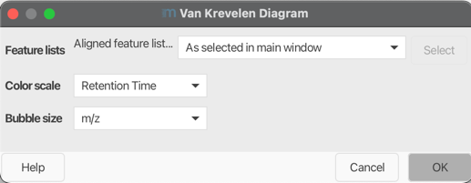

# Van Krevelen diagram
### Description
**Van Krevelen diagrams** are graphical plots developed by Dirk Willem van Krevelen (chemist and professor of fuel technology at the TU Delft) that are used to assess the origin and maturity of kerogen and petroleum.

The diagram cross-plots the hydrogen:carbon (hydrogen index) as a function of the oxygen:carbon (oxygen index) atomic ratios of carbon compounds.
!!! quote " "
1. Van Krevelen, D.W. (1950). "Graphical-statistical method for the study of structure and reaction processes of coal", Fuel, 29, 269-84
2. https://en.wikipedia.org/wiki/Van_Krevelen_diagram

!!! warning

    Since element ratios are plotted only annotated features are considered. 

### Parameters

#### Feature lists
Select feature list to display as Van Krevelen diagram.

#### Color scale
Select which parameters you want to display as a color scale.

#### Bubble size
Select which parameters you want to display as bubble size.

{{ git_page_authors }}
