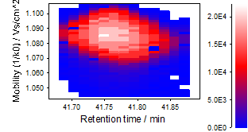

# Ion mobility data

Since ion mobility spectrometry (IMS) resolved data is more complex due to the additional dimension
when compared to regular LC-MS data, some terms shall be clarified before going into details of the
processing steps.

## Mobility separation and data format

Ion mobility separation usually occurs on the millisecond timescale, fitting nicely in-between
liquid chromatography (LC) (few seconds per chromatographic peak) and mass spectra acquisition of
TOF instruments (several micro seconds). Therefore, the mobility dimension can be resolved by
acquiring multiple spectra during a mobility separation (e.g. 1000 spectra per 100 ms). This leads
to multiple mass spectra acquired at one IMS accumulation. Thus, at one retention time, multiple
spectra are acquired. A detailed comparison of LC-MS and LC-IMS-MS raw data can be
found [here](lc-ms-and-lc-ims-ms-data-comparison.md#graphical-comparison-of-lc-ms-and-lc-ims-ms-data).

## Terminology

### Frames and Mobility Scans

During one IMS accumulation and separation, multiple mass spectra are acquired to resolve the
mobility dimension. All mass spectra acquired during one mobility separation are termed "_mobility
scans_" in MZmine. The agglomerate of all mobility scans for one IMS accumulation are called
"_frame_". All _mobility scans_ of a single _frame_ can be summed, to represent a single mass
spectrum as in classic LC-MS.

### Mobilograms

A "_mobilogram_" represents the intensity of an m/z or m/z range along the mobility axis. A
_mobilogram_ may be build from multiple frames and summed or built from a single frame.

### Ion mobility traces

An "_ion mobility trace_" basically represents a mobility resolved extracted ion chromatogram (EIC).

