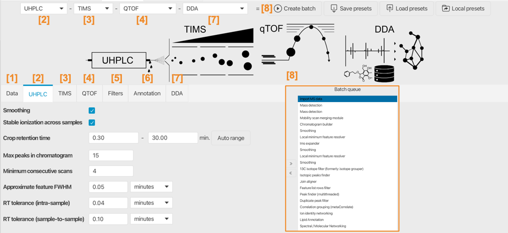
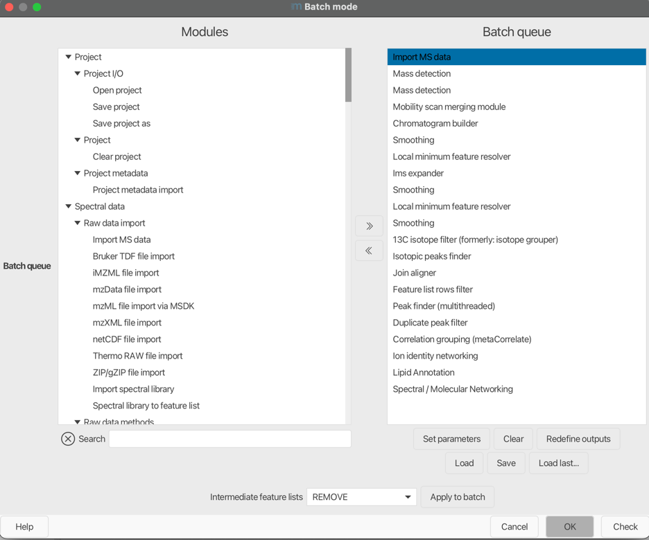

# Processing wizard

The processing wizard reduces the configuration of complex standardized workflows into few
parameters. Those values are used to estimate or calculate all other parameters from spectral
processing over feature detection and alignment to annotation and data export. The mzwizard organizes
the different parts of the instrumental setup to define a workflow split up into: Sample
introduction, IMS, MS instrument, and workflow. Ideas for a workflow? We are open for
ideas and contributions. Feel free to reach out if your workflow might be a candidate for a wizard
setup.

<video src="../reference_media/videos/mzwizard_docu.mp4" width="960" height="540" controls></video>

:material-menu-open: **Processing wizard**

!!! tip
The mzwizard is split into sections, most importantly, the MS part and the sample introduction.
Parameters here reflect the sensitivity, resolution, and accuracy of these parts of the hyphenation.
Selecting one of the default presets actually populates the initial values.

!!! danger
The defaults are only suggestions and different acquisition methods and instruments produce
different noise levels etc. The **raw data overview** and **aligned feature lists** are useful to
optimize these parameters.

## Parameter tabs

Produces this batch:

## Data import

Specify all data files that need to be processed

## Sample introduction system

Depends on the selected sampling system, e.g., MALDI, HPLC, ...

### Chromatography-based

#### Smoothing

Apply smoothing to the chromatograms. Smoothing should not be used for data low MS1 acquisition
rates (e.g. below 5 data points per chromatographic peak/feature).

Influences batch steps:
[Smoothing](module_docs/featdet_smoothing/smoothing.md)

#### Stable ionization across samples

Used during feature grouping of adducts and other ions of the same molecule. Only use if the
matrix (e.g., salt content, same culture medium, only fresh OR sea water samples) and ionization
efficiencies are comparable across the whole study.

Influences batch steps:
[Correlation grouping](module_docs/id_ion_networking/metacorr/metacorr.md)

#### Crop retention time

Crops the chromatograms at these retention time values. Useful to cut off the start and the end of
the chromatograms. The start is often diverted into the waist and the end often contains the cleanup
procedure.

Influences batch steps:
[Chromatogram building](module_docs/lc-ms_featdet/featdet_adap_chromatogram_builder/adap-chromatogram-builder.md)
[Local minimum feature resolver](module_docs/featdet_resolver_local_minimum/local-minimum-resolver.md) (Calculation of [chromatographic threshold](module_docs/featdet_resolver_local_minimum/local-minimum-resolver.md#chromatographic-threshold))

#### Max peaks in chromatogram

An estimate of the number of isomers and isobaric ions in the chromatograms. Used to estimate the
percentage of data points that hold useful data for the feature resolving step. (Chromatographic
threshold in local minimum resolver).

Influences batch steps:
[Local minimum feature resolver](module_docs/featdet_resolver_local_minimum/local-minimum-resolver.md) (Calculation of [chromatographic threshold](module_docs/featdet_resolver_local_minimum/local-minimum-resolver.md#chromatographic-threshold))

#### Minimum consecutive scans

Only keep chromatograms and features with at least X data points in retention time dimension.

Influences batch steps:
[Local minimum feature resolver](module_docs/featdet_resolver_local_minimum/local-minimum-resolver.md),
[Smoothing](module_docs/featdet_smoothing/smoothing.md), [Gap filling](module_docs/gapfill_peak_finder/gap-filling.md)

#### Approximate feature FWHM

The full-width at half maximum of peaks in retention time dimension. Best extracted from the feature
tables of already processed test datasets or from the raw data overview.

Influences batch steps:
[Local minimum feature resolver](module_docs/featdet_resolver_local_minimum/local-minimum-resolver.md),
([Minimum search range](module_docs/featdet_resolver_local_minimum/local-minimum-resolver.md#minimum-search-range-rtmobility-absolute))

#### RT tolerance (intra-sample)

Retention time tolerance to group adducts and isotopes of the same molecule. The comparison is
performed within each individual sample, usually leading to small variance.

Influences batch steps:
[Isotope grouping](module_docs/filter_isotope_filter/isotope_filter.md),
[Correlation grouping](module_docs/id_ion_networking/metacorr/metacorr.md)

#### RT tolerance (sample-to-sample)

Retention time tolerance to align features across all samples. Dependent on retention time shifts.

Influences batch steps:
[Join Aligner](module_docs/align_join_aligner/join_aligner.md),
[Gap filling](module_docs/gapfill_peak_finder/gap-filling.md),
[Local compound database search](module_docs/id_prec_local_cmpd_db/local-cmpd-db-search.md)

## Ion mobility instrument

#### Smoothing

Applies smoothing to the ion mobilograms. This should be enabled for long ramp times in TIMS
instruments.

Influences batch steps:
[Smoothing](module_docs/featdet_smoothing/smoothing.md#mobility-dimension)

#### Minimum consecutive scans

The number of consecutive scans/datapoints in a valid ion mobilogram and feature. Increase this for
longer ramps in TIMS instruments.

Influences batch steps:
[Smoothing (mobility dimension)](module_docs/featdet_smoothing/smoothing.md#mobility-dimension),
[Local minimum resolver (mobility dimension)](module_docs/featdet_resolver_local_minimum/local-minimum-resolver.md#resolving-the-ion-mobility-dimension)

#### Approximate feature FWHM

The full-width at half maximum for IMS features with regard to the IMS dimension.

Influences batch steps:
[Local minimum resolver (mobility dimension)](module_docs/featdet_resolver_local_minimum/local-minimum-resolver.md#resolving-the-ion-mobility-dimension)

## MS instrument, e.g., Orbitrap, QTOF, FTICR

#### Noise threshold (MS1/MS2)

Choose the mass detector from the drop down menu. Choose the **Factor of lowest signal** for both
centroided or profile data where each spectrum contains noise signals, often represented by many
signals at the same low intensity (spectral grass). This may correspond to static noise or single
counts. If the spectra are free of noise, for example
because they were already filtered, use an **absolute intensity** threshold.

Depending on the selected mass detector, separate absolute noise levels or factors are defined to
threshold spectra of MS level 1 and 2 (or above). So the MS2 noise level is used for MSn data with
level > 1. These parameters can be optimized by looking at the spectral raw data in the raw data
overview.

Influences batch steps:
[Mass detection (MS1, MSn)](module_docs/featdet_mass_detection/mass-detection.md) 1/5th of the value
is used
for [ion mobility scans](terminology/ion-mobility-terminology.md#accumulations-mobility-scans-and-frames).

#### Minimum feature height

The minimum height of chromatograms and features.

Influences batch steps:
[ADAP Chromatogram builder](module_docs/lc-ms_featdet/featdet_adap_chromatogram_builder/adap-chromatogram-builder.md),
[Local minimum feature resolver (RT dimension)](module_docs/featdet_resolver_local_minimum/local-minimum-resolver.md),
[Local minimum feature resolver (IMS dimension)](module_docs/featdet_resolver_local_minimum/local-minimum-resolver.md),
DIA MS2 grouping (todo documentation),
[RT Calibration](module_docs/norm_rt_calibration/norm_rt_calibration.md)

#### Scan-to-scan m/z tolerance

Relative and absolute m/z tolerance. Always applies the maximum tolerance based on the m/z this
means that smaller and higher values are stronger affected by the absolute and relative tolerance,
respectively.
Used to find the same signal in different scans when connecting chromatograms. Reflects on the mass
accuracy between scans in the same raw data file.

Influences batch steps:
[Mobility scan merging](module_docs/featdet_mobility_scan_merging/mobility-scan-merging.md),
[ADAP Chromatogram builder](module_docs/lc-ms_featdet/featdet_adap_chromatogram_builder/adap-chromatogram-builder.md),
[Gap filling](module_docs/gapfill_peak_finder/gap-filling.md),
[Lipid annotation (MS2)](module_docs/id_lipid_annotation/lipid-annotation.md),
[Spectral library search](module_docs/id_spectral_library_search/spectral_library_search.md),
[Spectral/ Molecular Networking](module_docs/group_spectral_net/molecular_networking.md),
DIA MS2 grouping (todo documentation)

#### Feature-to-feature m/z tolerance

Relative and absolute m/z tolerance. Always applies the maximum tolerance based on the m/z this
means that smaller and higher values are stronger affected by the absolute and relative tolerance,
respectively.
Used to group isotopes and adducts of the same molecule. Those m/z values are already averaged over
their features and should have lower m/z differences that the scan to scan tolerance.

Influences batch steps:
[Isotope filter](module_docs/filter_isotope_filter/isotope_filter.md)
[Isotope finder](module_docs/filter_isotope_finder/isotope_finder.md)
[Ion identity networking](module_docs/id_ion_networking/iin/iin.md)
[Duplicate filter](module_docs/filter_duplicate_features/duplicate_feature_filter.md)

#### Sample-to-sample m/z tolerance

Relative and absolute m/z tolerance. Always applies the maximum tolerance based on the m/z this
means that smaller and higher values are stronger affected by the absolute and relative tolerance,
respectively.
Used to align features across samples. Those m/z values are already averaged over their features but
originate from different samples.

Influences batch steps:
[Join Aligner](module_docs/align_join_aligner/join_aligner.md)
[Local compound database search](module_docs/id_prec_local_cmpd_db/local-cmpd-db-search.md)
[Lipid annotation (MS1)](module_docs/id_lipid_annotation/lipid-annotation.md)

[//]: # ([ADAP aligner]&#40;module_docs/align_adap/align_adap_gc.md&#41;)

## Filters

#### Original feature list

Options to either _keep_ or _remove_ the original feature lists. _Keep_ is valuable during workflow
optimization whereas _remove_ saves resources and allows for more performant processing or large
datasets. (See section on performance).

Influences batch steps:
all batch steps that create a new feature list.

#### Min samples per aligned feature

Only keep aligned features that were detected in at least n samples. This parameter should usually
scale with the sampleset size and if samples are relatively similar from their compounds. Uses the
maximum of an absolute and relative value.

Influences batch steps:
[Feature list rows filter](module_docs/feature_list_row_filter/feature_list_rows_filter.md#minimum-features-in-a-row-abs-or-percent)

#### Only keep features with 13C

Detect isotope pattern and only keep feature with valid 13C isotope pattern.

Influences batch steps:
[Feature list rows filter](module_docs/feature_list_row_filter/feature_list_rows_filter.md#validate-13c-isotope-pattern)

## Annotation

#### Local compound database 

- Specify the database file (csv or tsv format).
- Select precursor m/z option to either
    - calculate from given neutral mass (or formula/structure)
    - use provided precursor m/z in column
- Filename column is only used for the library generation workflow
- Columns map the table column headers to the internal names in mzmine
    - Select data types present in local compound database

#### Annotate lipids
Select if you want to annotate lipids. Lipid database scope can be defined in the [Lipid annotation](module_docs/id_lipid_annotation/lipid-annotation.md).

#### Spectral library files

Select all spectral libraries to import and use during spectral library matching to annotate
compounds in the final aligned feature list.

Influences batch steps:
[Spectral library search](module_docs/id_spectral_library_search/spectral_library_search.md)

Influences batch steps:
[Local compound database](module_docs/id_prec_local_cmpd_db/local-cmpd-db-search.md)

## Workflows

Most of the parameters in the workflow section define data output and some workflow specific
parameters.

### General parameters

- Apply [spectral networking](module_docs/group_spectral_net/molecular_networking.md) (FBMN/IIMN): Will compare all MS2 spectra across features to form
  molecular networks by spectral similarity.
- Define an export path and base file name, e.g., *"D:\analysis\date_project"*  this will create a
  new folder and save all files from export modules there. Each module will add a specific suffix to
  the file name.
- Export for molecular networking (e.g., GNPS, FBMN, IIMN, MetGem): Will export all files for
  molecular networking
- Export for SIRIUS: Will export all files needed for SIRIUS
- Export annotation graphics: Exports annotations like spectral library matches, lipid matches, etc.
  to graphical reports. Contains options to also export chromatographic/ion mobility shapes, images,
  and other plots.

### Workflow parameters and descriptions

#### DDA

The data-dependent acquisition workflow is the default non target workflow. We recommend to also use
this workflow for targeted analysis and combine it with the [Local compound database search](module_docs/id_prec_local_cmpd_db/local-cmpd-db-search.md) or [Spectral library search](module_docs/id_spectral_library_search/spectral_library_search.md) annotation modules.

#### DIA

The data-independent acquisition workflow is can process any type of MSe, broad band CID, or all ion fragmentation experiments. Add a minimum DIA correlation coefficient and a minimum number correlated data points in of MS2 data points.

#### Library generation

More method and contributor **metadata** is required to build spectral libraries. This workflow
produces reference libraries with options to filter and merge spectra.

#### Imaging
!!! info
This workflow is only available for the sampling techniques: **MALDI**, **LDI**, **DESI**, **SIMS**

Select if you want to co-localize images.

#### Target plate
!!! info
This workflow is only available for the sampling technique: **MALDI** (Bruker timsTOF only)

Select if you want to co-localize images.

#### Spectral deconvolution
!!! info
This workflow is only available for the sampling technique: **GC-EI** 

Select the minimum number of signals in a deconvoluted spectrum

{{ git_page_authors }}

