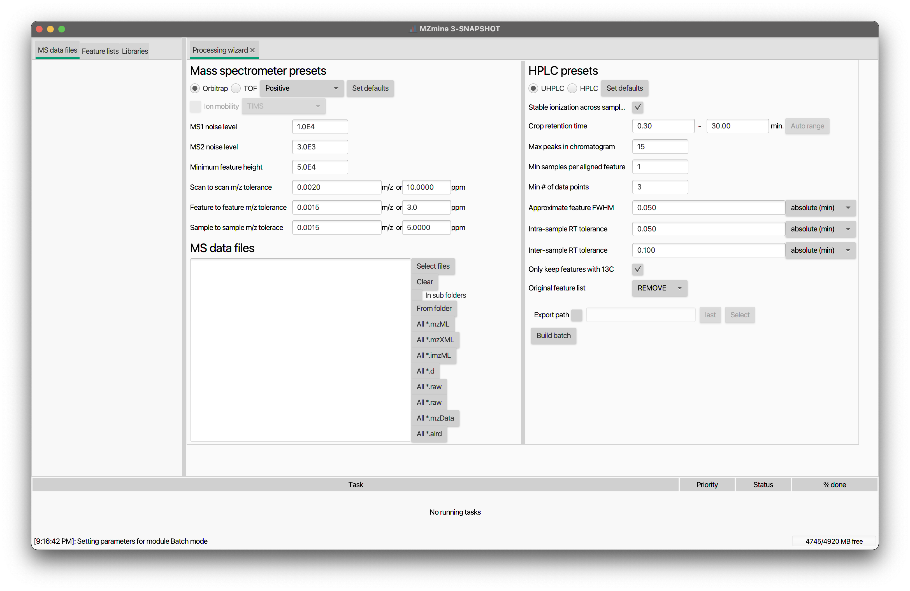

# **Batch processing**

Besides the interactive [GUI](../../main-window-overview.md), MZmine allows the user to run processing workflows in an automated manner using the "batch mode". Entire processing pipelines (including data import/export) can be run with few clicks, or even through the command-line application. This makes MZmine suitable to be integrated into automated data analysis pipelines (e.g. QC systems).

Batch files (XML format) are essentially lists of tasks run by MZmine one after another. Any of the methods available in MZmine 3 can be included in the batch file.

---
## **How to run batch processing**

**Project :material-arrow-right-thin: Batch mode**

When a new step is added to the queue its parameter setup dialog is shown. The "Set paramaters" button allows the user to modify a step's parameter settings. The "Clear" button removes all steps. The "Load" and "Save" buttons make it possible to read and write batch steps to XML files.

The first step of a batch queue is performed on those raw data files and/or peak lists selected by the user. The remaining steps are performed on the results produced by each preceding step (File/Feature list selection must be set to _Those created by previous batch step_). For example, if the first step of the batch queue is the [ADAP chromatogram builder](../../module_docs/featdet_adap_chromatogram_builder/adap-chromatogram-builder.md), it will produce peak lists as a result. If the following step were Peak list deconvolution then it will be performed on the peak lists produced by the preceding Chromatogram builder step.

:octicons-alert-16: **Tip** MZmine "remembers" the last settings used.

# Processing wizard
The processing wizard is inteded to quickly set up a general workflow for the processing of untargeted LC-MS and LC-IM-MS data. By clicking the "Set default" button, default settings for mass and feature detection are also provided according to the selected MS type (Orbitrap or TOF) and LC system (UHPLC or HPLC). Once the desired parameters have been set, hit the "Build batch" botton and a pre-populated batch window will open up.

**Tools :material-arrow-right-thin: Processing wizard**

 
### **Mass spectrometers presets**
MS type: When TOF is selected, the "Ion mobility" can be enabled  
MS1 and MS2 noise level:  
Minimum feature height:  
Scan to scan m/z tolerance:  
Feature to feature m/z tolerance:  

### **HPLC presets**
Stable ionization across samples:  
Crop retention time:  
Max peaks in chromatogram:  
Min samples per aligned feature:  
Min # of data points:  
Approximate feature FWHM:  
Intra-sample RT tolerance:  
Inter-sample RT tolerance:  
Only keep feature with 13C:  
Original feature list:  
Export path:  

!!! warning 

    The default settings were optimized on sample datasets used during the MZmine 3 development. Although probably suitable for many appications, it is strongly recommended not to blindly rely on them. Rather, optimal processing parameters should be chosen based on the LC-(IM)-MS system performance and data acquisition settings.

