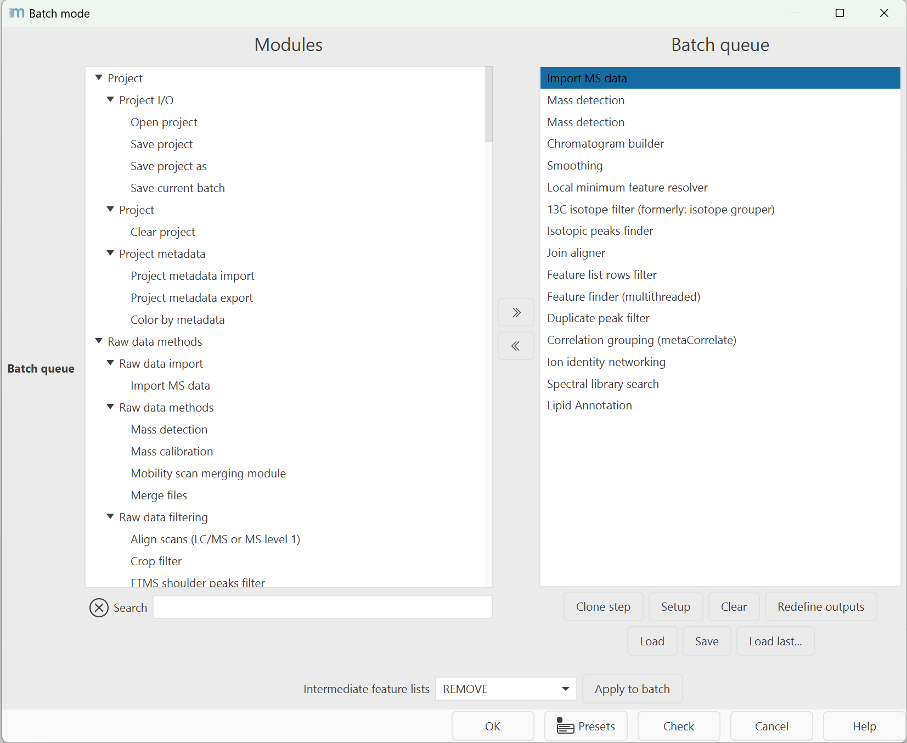

# **Batch mode processing**

Besides the interactive [GUI](../../main-window-overview.md), mzmine allows the user to run processing workflows in an 
automated manner using the "batch mode". Entire processing pipelines (including data import/export) 
can be run with few clicks, or even through the command-line application. This makes MZmine suitable
to be integrated into automated data analysis pipelines (e.g., QC systems).

Batch files (XML format) are essentially lists of tasks run by mzmine one after another. Any of the 
methods available in mzmine can be included in the batch file.

---
## **How to run batch processing**

**Project :material-arrow-right-thin: Batch mode**

When a new step is added to the queue its parameter setup dialog is shown. The "Set parameters" 
button allows the user to modify a step's parameter settings. The "Clear" button removes all steps. 
The "Load" and "Save" buttons make it possible to read and write batch steps to XML files.

!!! tip

    **Redefine outputs** is a quick aid to set a new file path and base filename to all export modules 
    (e.g., the feature list CSV export). Each step will add a suffix for the user to identify the 
    output files. If one module exists multiple times, the suffix will also contain a numbering.

The first step of a batch queue is performed on those raw data files and/or feature lists selected
by the user. The remaining steps are performed on the results produced by each preceding step 
(File/Feature list selection must be set to _Those created by previous batch step_). For example, 
if the first step of the batch queue is the [Chromatogram builder](../../module_docs/lc-ms_featdet/featdet_adap_chromatogram_builder/adap-chromatogram-builder.md), it will produce feature 
lists as a result. If the following step were Peak list deconvolution then it will be performed 
on the peak lists produced by the preceding Chromatogram builder step.

:octicons-alert-16: **Tip** mzmine "remembers" the last settings used.

!!! tip

    **Intermediate feature lists** is an option to apply the same handling of intermediate results 
    to all batch steps. For example set all to keep during batch optimization or to remove/process 
    in place, to run a final batch with maximum performance.

# mzwizard
The [**mzwizard**](../../wizard.md) facilitates quick set up of general workflows for various sample introduction systems, (ion mobility) mass spectrometers, and workflows.
This is the recommended way to configure workflows and create batch files. Batch files can then be modified further to improve results or to add more export steps. 

**mzwizard :material-arrow-right-thin: Processing wizard**

{{ git_page_authors }}