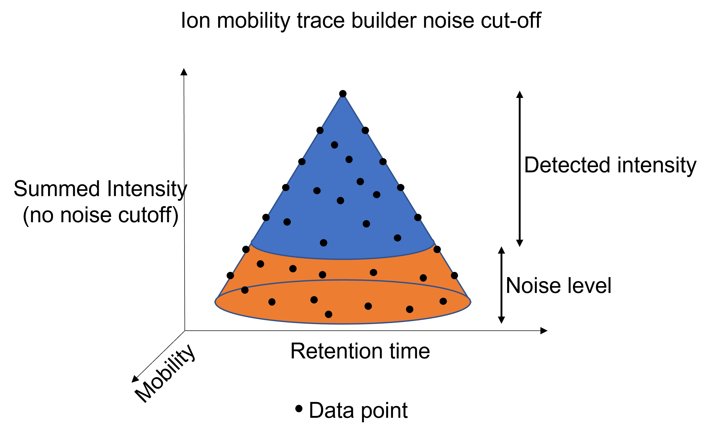
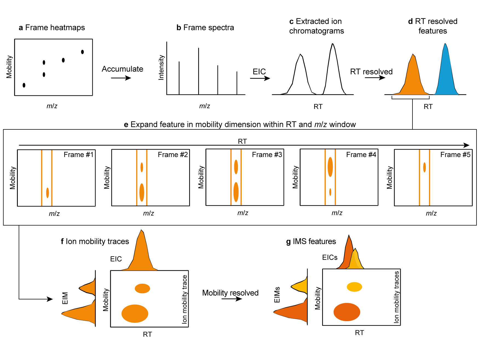

# Untargeted LC-IMS-MS Workflow Overview

Compared to regular LC-MS, LC-IM-MS data is more complex due to the additional separation dimension.
Since some terms might not be straightforward for new users, a basic explanation of IM separation
principles and the terminology used within this documentation is
provided [here](../../terminology/ion-mobility-terminology.md).

## Supported formats

* Vendor formats:
    * .tdf (Native Bruker LC-IMS-MS and MALDI-IMS-MSI format)
    * .tsf (Native Bruker MALDI-IMS-MS (single shot) format)
* .mzML
    * Created via [MSConvert](https://proteowizard.sourceforge.io/download.html) from native Bruker
      data
    * Created via [MSConvert](https://proteowizard.sourceforge.io/download.html) from native
      Waters/Agilent data

***

## Feature detection workflows

Ion mobility data can be processed in MZmine 3 in two ways. The first few steps are different for
the two workflows (see below).

1. [LC-IMS-MS workflow via **ADAP Chromatogram builder and IMS expander** **(
   recommended)**](#lc-ms-workflow-recommended)
2. [LC-IMS-MS workflow via **Ion mobility trace builder / Recursive IMS
   builder**](#lc-ims-ms-workflow)

While these lists might seem fairly similar, there are some differences in the processing approach.
The LC-IMS-MS workflow builds ion mobility traces from the data in the mobility scans, whilst the
LC-MS workflow builds EICs from the summed frames. For ion mobility data imported from .mzML files,
accumulated frame spectra have to be built from the individual mobility scans
after [mass detection](../../module_docs/featdet_mass_detection/mass-detection.md). Since the mass
detection impacts the computation of accumulated frame spectra in the same way it would impact
the [ion mobility trace builder](#lc-ims-ms-workflow), the differences from this workflow and
the [ADAP workflow](#lc-ms-workflow-recommended) will be negligible.  
However, frame spectra for native Bruker .tdf raw data are summed by the vendor library during file
import. Here, the frame spectra are generated from the raw data and thus result in higher
intensities, since the low abundant data points on the edges of the mobility and retention time
peaks are not cut-off by the mass detection step. (see below)

Therefore, the more low abundant compounds might be detected, if
the [LC-MS workflow](#lc-ims-ms-workflow) is recommended.

### LC-MS workflow (recommended)

LC-IMS-MS data can also be processed via the regular LC-MS modules. If necessary, detected features
can be expanded into the mobility dimension.

For this workflow, generation of summed frame spectra via
the [Mobility scan merging](../../module_docs/featdet_mobility_scan_merging/mobility-scan-merging.md)
module
is a mandatory step, if the data was imported from an .mzML file (automatically generated via native
Bruker import).

- [Data import](../../module_docs/io/data-import.md#lc-ims-ms-data)
- [Mass detection](../../module_docs/featdet_mass_detection/mass-detection.md)
- [Mobility scan merging](../../module_docs/featdet_mobility_scan_merging/mobility-scan-merging.md) (
  mzML
  data only)
- [ADAP Chromatogram builder](../../module_docs/lc-ms_featdet/featdet_adap_chromatogram_builder/adap-chromatogram-builder.md)
- [Smoothing in retention time dimension (optional)](../../module_docs/featdet_smoothing/smoothing.md)
- [Resolving in retention time dimension](../../module_docs/featdet_resolver_local_minimum/local-minimum-resolver.md)
- [Expanding EICs in mobility dimension](../../module_docs/lc-ims-ms_featdet/featdet_ims_expander/ims-expander.md)
- [Smoothing  in mobility dimension (optional)](../../module_docs/featdet_smoothing/smoothing.md#mobility-dimension)
- [Resolving in mobility dimension](../../module_docs/featdet_resolver_local_minimum/local-minimum-resolver.md#resolving-the-ion-mobility-dimension)
- [Smoothing in rt and mobility dimension (optional)](../../module_docs/featdet_smoothing/smoothing.md)
    - Some recognised features might have rather noisy signals (in rt and mobility dimension) after
      the mobility resolving step. If smoother shapes are required, the smoothing can be reapplied
      afterwards. In that case, smoothing can be applied to both dimensions at once.

The basic principle of the workflow is illustrated below:

**a**, IMS heatmaps are accumulated to frame spectra (**b**). From the accumulated frame
spectra, [EICs](../../terminology/general-terminology.md#Extracted-ion-chromatogram) are built (**c**).
These EICs are resolved to individual features
by a [resolver](../../module_docs/featdet_resolver_local_minimum/local-minimum-resolver.md) (**d**).
The resolved features are now defined by RT and m/z windows, which can be expanded in mobility
dimension by
the [Ims expander](../../module_docs/lc-ims-ms_featdet/featdet_ims_expander/ims-expander.md) (**e**).
The resulting ion mobility traces (**f**), have to be resolved in mobility dimension afterwards, to
create individual IMS features.

### LC-IMS-MS workflow

The LC-IMS-MS workflow will directly
build [ion mobility traces](../../terminology/ion-mobility-terminology.md#ion-mobility-trace) from
the raw data in the mobility scans. This workflow does not necessarily require summed frame spectra.
However, if extracted ion chromatograms shall be visualized via
the [Chromatogram visualizer](../../visualization_modules/raw_data_overview/raw_data_additional.md#chromatogram-plot),
the frame
intensities are used. In case these are not present, the chromatograms will be blank. Note that
feature intensities from the LC-IMS-MS workflow might not exactly match the frame chromatograms due
to summing being executed prior to thresholding (for native Bruker data). Furthermore, multiple
isomers might hide behind a single chromatographic peak.

- [Data import](../../module_docs/io/data-import.md#lc-ims-ms-data)
- [Mass detection](../../module_docs/featdet_mass_detection/mass-detection.md)
- [Ion mobility trace builder](../../module_docs/lc-ims-ms_featdet/featdet_ion_mobility_trace_builder/ion-mobility-trace-builder.md)
- [Smoothing in retention time dimension (optional)](../../module_docs/featdet_smoothing/smoothing.md)
- [Resolving in retention time dimension](../../module_docs/featdet_resolver_local_minimum/local-minimum-resolver.md)
- [Smoothing  in mobility dimension (optional)](../../module_docs/featdet_smoothing/smoothing.md#mobility-dimension)
- [Resolving in mobility dimension](../../module_docs/featdet_resolver_local_minimum/local-minimum-resolver.md#resolving-the-ion-mobility-dimension)
- [Smoothing in rt and mobility dimension (optional)](../../module_docs/featdet_smoothing/smoothing.md)
    - Some recognised features might have rather noisy signals (in rt and mobility dimension) after
      the mobility resolving step. If smoother shapes are required, the smoothing can be reapplied
      afterwards. In that case, smoothing can be applied to both dimensions at once.

## Graphical comparison of LC-MS and LC-IMS-MS data

[Data comparison](lc-ms-and-lc-ims-ms-data-comparison.md)

## Page Contributors

{{ git_page_authors }}
