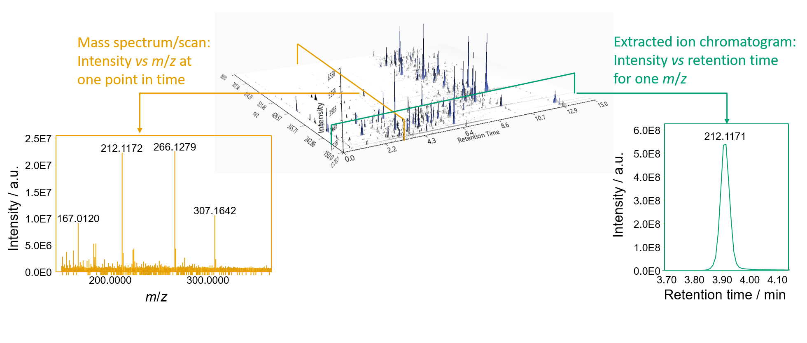

# **Graphical comparison of LC-MS and LC-IMS-MS data**

**Classic LC-MS data** consists of three dimensions: 

- m/z, 
- intensity, 
- and retention time. 

At every retention time, a whole mass spectrum is acquired (yellow). 
Putting all scans together creates a three-dimensional plane. By slicing the three-dimensional data at a single m/z value (+- a value of tolerance),
[**EICs**](../../terminology/general-terminology.md#extracted-ion-chromatogram) can be created (green).

**Ion mobility resolved data**, on the other hand, consists of a three-dimensional data plane at each
retention time. 
The three dimensions being:

- m/z, 
- intensity,
- and mobility (as drift time (ms) or
inverse reduced mobility $1/K_0 [Vs/(cm^2)]$). 

The 3D projection of regular LC-MS data can be created
by summing all mobility scans of a frame to create a frame spectrum.
(see [Mobility scan merging](../../module_docs/featdet_mobility_scan_merging/mobility-scan-merging.md))

