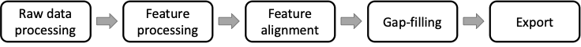

# LC-MS Workflow
The workflow proposed herein is intended as a general data preprocessing pipeline that turns raw LC-MS (or LC−MS/MS) data into a list of all the detected features, and corresponding signal intensity, detected across the analysed samples. The produced feature lists can then be exported for furhter downstream analysis (e.g., identification, search against spectral libraries, statistical analysis, etc.). 
A schematic representation of the workflow is shown below:

## Raw data processing
The first two steps are particularly important because errors in these steps propagate not only through the entire data preprocessing steps but affect subsequent statistical analysis and metabolic pathway analysis as well.

The raw data processing consists of essentially two steps: [Data import](../../module_docs/dataimport/data-import.md#lc-ms-data) and [Mass detection](../../module_docs/massdetection/mass-detection.md)
  
### Raw data import
Either open (e.g. mzML) and native vendor (e.g. Thermo, Bruker) data formats can be imported in MZmine 3. All the supported formats are listed here (LINK to Doc). For more details see the [Data import](../../module_docs/dataimport/data-import.md#lc-ms-data) module.

### Mass detection
This step produces a list (referred to as "mass list") of the m/z values found in each MS scan across the LC run that exceed a user-defined threeshold (i.e. noise level). For more details see the [Mass detection](../../module_docs/massdetection/mass-detection.md) module.

## Feature processing
The goal of the "Feature processing" is to obtain a list of all the detected features (characterized by a RT and m/z value) from the raw LC-MS data.

### Chromatogram building
The first step in the "Feature processing" is to build the so-called extracted ion chromatograms (EICs) for each detected mass (see "Mass detection").
There are two modules in MZmine 3 that can fulfil this task: [ADAP chromatogram builder](../../module_docs/adapchromatogrambuilder/adap-chromatogram-builder.md) (widely used) and **Grid mass** (create docs).

The "detected" features in each file are listed in the so-called "feature lists", which are then further processed.

(e.g.,  to  ) and aligned to connect correspond-ing features across all samples.

### Smoothing in retention time dimension (optional)
- Optional, depends on the LC peak shape
- For more details see the [Mass detection](../../module_docs/massdetection/mass-detection.md) module.

[Smoothing](../../module_docs/smoothing/smoothing.md)

### Feature resolving

[Local minimum resolver](../../module_docs/localminimumresolver/local-minimum-resolver.md)

### De-isotoping
- Remove features produced by natural isotopes
- For more details see the [Gap-filling](directory/gap-filling.md) module.

### Gap-filling
Gap-filling can be performed on the aligned feature lists to cope with missing features that might be artifacts of the feature-detection process.
- For more details see the [Gap-filling](directory/gap-filling.md) module.

## Page Contributors

{{ git_page_authors }}
