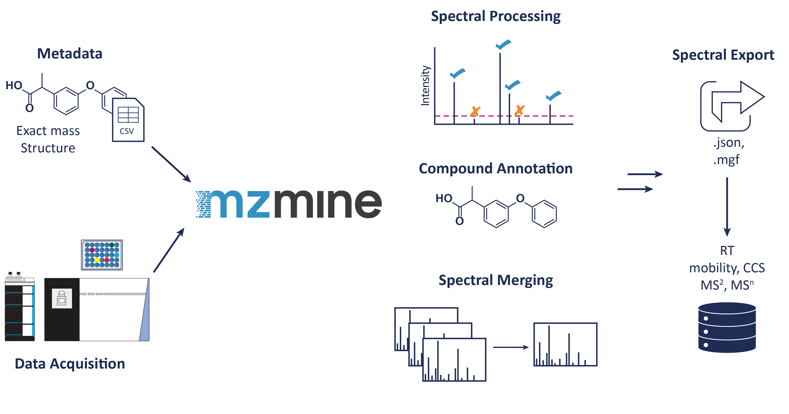
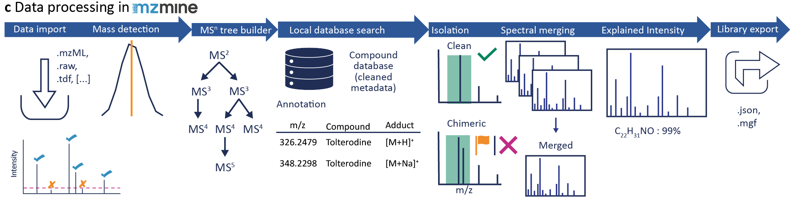
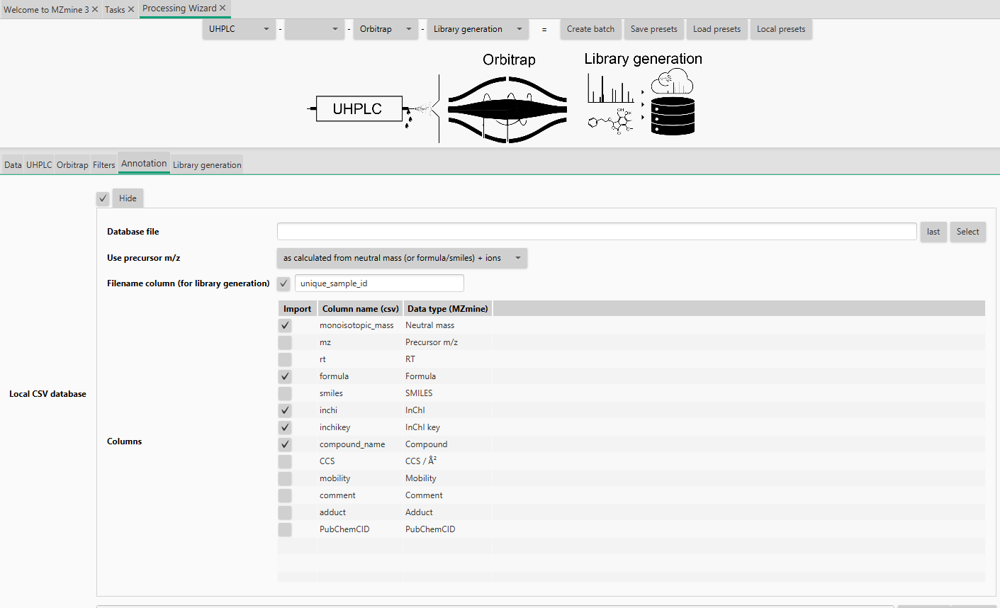

# Library generation workflow

This workflow is intended to extract library spectra automatically from your mass spectrometry data.
The general idea is, to link the metadata to your mass spectrometry data. This facilitates the data
processing at any time and enables the data extraction for each compound in the corresponding injection.
Therefore, a unique sample id in the metadata table that is also used as part of the filename links the mass 
spectrometry data with the analyzed compounds, which is used during the MZmine processing.

## Overview

The following steps are included:
- Metadata clean up (Python script)
- Sequence creation (Python script for Thermo)
- Data acquisition
- Data conversion to mzML and centroiding (MSConvert, ThermoRawFileParser,...)
- Automatic library building workflow in MZmine by using the converted data files + cleaned Metadata
- Uploading of the raw data files, the library file(s) and the cleaned metadata

## Related resources

- [Metadata Template](https://docs.google.com/spreadsheets/d/1v6_IlGS3VgycGc-mSSdNeocY-CFXpONVZbuh3XNLX2E/edit?usp=sharing)
- [Metadata cleanup](https://github.com/corinnabrungs/msn_tree_library)
- [Metadata upload](https://github.com/merlin-ms/mass-spectral-library-network)
- [Sequence creation](https://github.com/corinnabrungs/msn_tree_library)
- [MZmine batch example](https://github.com/merlin-ms/templates-and-example)

## Providing of metadata

The metadata are used for further processing including a clean up step, which means cleaning a given
structure or searching for missing structures by a unique identifier, e.g., PubChem CID, or name, and adding further
information by public database search. 
Therefore, we provide this
[Template](https://docs.google.com/spreadsheets/d/1v6_IlGS3VgycGc-mSSdNeocY-CFXpONVZbuh3XNLX2E/edit?usp=sharing)
to harmonize column names. The best would be to provide a compound name and the SMILES or InChI together with
the rack or plate and well location. The library id can be used to link the dataset to a specific 
standard library or subset that you used. The unique sample id will be build during the metadata clean up
to link the dataset with the metadata. This can be also the whole filename or part of it if data were already acquired.
If a full filename is used, this identifier needs to be changed if data are newly acquired and the filename changes. 
All other columns are optional and can be filled during the clean up step.

### Cleaning of metadata

We provide a Python written metadata clean up script to remove salts from SMILES structures and to 
search for structure information in PubChem if only a name or PubChem CID is given. Based on the cleaned
SMILES, different structure information are computed, including the canonical and isomeric SMILES, SMARTS,
the monoisotopic mass, InChI and InChIKey. Especially the monoisotopic mass is important for the automatic
library generation workflow to match the measured mass against possible masses of the compound's adduct.
Additionally, we need a unique sample id to search compounds only in the corresponding data file. This
unique sample id is build by the library id, e.g., group+library, and the well/vial location including
the plate/rack and ending with _id. Furthermore, we included searches in public databases to gather
additional information about each compound, especially drug related information, e.g., in any
clinical phase or indication. The script can be found on
[GitHub](https://github.com/corinnabrungs/msn_tree_library).

### Uploading of metadata and raw data

The library building is a non-static workflow. Accordingly it is important to link raw data
to their metadata to optimize the spectra extraction based on new knowledge, quality parameters and
contamination in the future. Normally, library spectra are exported, maybe manually curated and stay
as they are within the spectral database, without further knowledge about the processing behind. A
repository to upload the metadata and raw data can be found on
[GitHub](https://github.com/merlin-ms/mass-spectral-library-network).

## Sequence creation for data acquisition

The shape of the data acquisition sequence table is vendor specific. We provide a python script for
XCalibur Thermo and we will update it for further instruments. The columns should be named as in the
[Metadata Template](https://docs.google.com/spreadsheets/d/1v6_IlGS3VgycGc-mSSdNeocY-CFXpONVZbuh3XNLX2E/edit?usp=sharing).
For Thermo following information are needed:

- Data acquisition storing path
- Instrument method path (multiple polarities are possible)
  - sequence will be first for one rack or well in one polarity and switch to the other in the second run
- Autosampler location for each well or rack
- Injection volume µL
- library identifier, for example group and used library
- Option:
  - Adding a method suffix, if different methods will be used for comparison, (e.g., changing AGC 
target, column,...)
  - Running blanks and QC after a specific number of injections (position of blank and QC needed)

The sequence is exported individually for each plate or rack and as a combined sequence. The combined
sequence will have the Blank and QC in the beginning and end of the sequence and after the set number of injections.
The data acquisition file names will be a combination of the date, unique sample id, the method
suffix, and polarity.
[GitHub](https://github.com/corinnabrungs/msn_tree_library)

## Data processing in mzmine

Data should be converted to open data formats, e.g., mzML before importing in MZmine. This step guarantees
the import at any time, since the vendor formats can change. For more information and possibilities go to
[Data conversion](../../data_conversion.md).

In MZmine, open the Processing wizard to creat your own batch configuration. Change the instrument 
settings to your instrument set up, e.g., Flow inject, and Orbitrap, and to **Library generation**.
For more information, go to the [Processing wizard](../../wizard.md) page. The default settings are
only suggestions and need to be updated and optimized for each dataset.

Under the **Annotation** tab you need to upload your metadata sheet (Local CSV database):
- Tick the checkbox and Show
- Set the path to your metadata file
- Set if the precursor should be calculated by neutral mass (or structure)+adduct or the precursor
m/z is stored in the table for each compound individually (important, if the adduct formation is very
different in one dataset
  - If you want to use the adduct calculation, the adducts can be selected after batch creation
- Tick the filename column and type in the column name header
  - You need a unique sample id in the metadata table that is included in the filename. It can be
    the whole filename or just a part of it, so you can use the same table if only the date in your 
    filename changes. If you use the metadata cleanup (creates the unique sample id) and the sequence
creation, the filename is created by the date, unique sample id, method suffix and polarity.
  - The unique sample id should not end on a number, as this will enable false matches, e.g., A2 is
  also in A20, A200,... 
- Select all column you want to import
  - Enable the Neutral mass type in MZmine, if you want to calculate the precursors, otherwise use the 
  Precursor m/z type
  - you can change the name by double click, changing the name,
  and pressing enter
    - To press enter is important as the name will not be saved otherwise

Go to **Library generation** tab:
- You can add specific information to your library, e.g., what was the library, which instrument, who
acquired the data, or who is the PI,...)
- Set the **Export path** to store the extracted library

After you set everything, you can safe the presets. You can safe the library method separately from
the sample introduction and instrument, to stitch the library settings together with any other instrument
setup. Click the **Create batch** button, which opens a new window. Every algorithm is prefilled by
the wizard settings.

Go to the **Custom database search** to change more library settings, especially possible adducts.
Go to the **Batch spectral library generation** to set the format and the MS level for the export.
Furthermore you can set additional quality settings, including the handling of chimeric spectra, 
minimum number of signals and minimum number of explained signals in each scan
based on all subformula combinations.
For more information about each parameter go to
[Custom database search](../../module_docs/id_prec_local_cmpd_db/local-cmpd-db-search.md)
and [Batch spectral library generation](../../module_docs/io_spectral_library_export/spectral_library_generation.md)

During the spectral library export, all set quality parameter are checked and only spectra that fulfill
all set criteria are exported. For chimeric spectra, instead of discarding those, they can be flagged
as chimeric.
